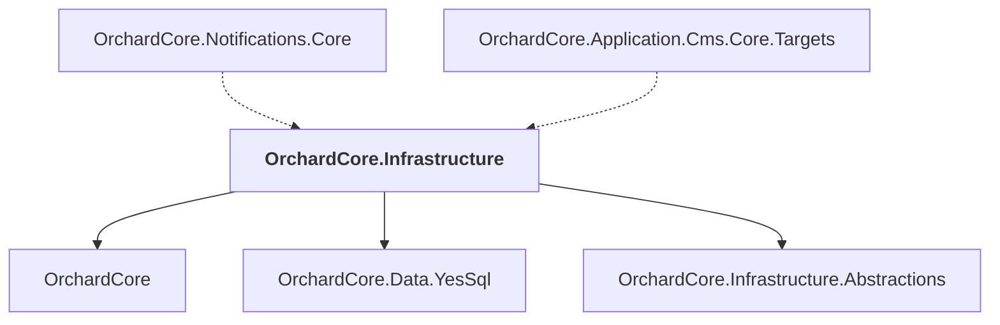

# OrchardCore.Infrastructure

## Overview

| Property | Value |
|----------|-------|
| Category | Library |
| Repository | src |
| Path | `OrchardCore/OrchardCore.Infrastructure/OrchardCore.Infrastructure.csproj` |
| Project References | 3 |
| NuGet Dependencies | 2 |
| Consumers | 2 |

## Dependency Diagram

## Project References
- OrchardCore
- OrchardCore.Data.YesSql
- OrchardCore.Infrastructure.Abstractions

## Consumed By
- OrchardCore.Notifications.Core
- OrchardCore.Application.Cms.Core.Targets

## External NuGet Packages
| Package | Version |
|---------|---------||
| HtmlSanitizer |  |
| MimeKit |  |

---

*[Back to Index](../../index.md)*
