# OrchardCore.Layers

## Overview

| Property | Value |
|----------|-------|
| Category | Library |
| Repository | src |
| Path | `OrchardCore.Modules/OrchardCore.Layers/OrchardCore.Layers.csproj` |
| Project References | 14 |
| NuGet Dependencies | 0 |
| Consumers | 1 |

## Dependency Diagram

```mermaid
graph TD
    OrchardCore_Layers["<strong>OrchardCore.Layers</strong>"]
    OrchardCore_Admin_Abstractions["OrchardCore.Admin.Abstractions"]
    OrchardCore_Layers --> OrchardCore_Admin_Abstractions
    OrchardCore_Apis_GraphQL_Abstractions["OrchardCore.Apis.GraphQL.Abstractions"]
    OrchardCore_Layers --> OrchardCore_Apis_GraphQL_Abstractions
    OrchardCore_ContentManagement_Abstractions["OrchardCore.ContentManagement.Abstractions"]
    OrchardCore_Layers --> OrchardCore_ContentManagement_Abstractions
    OrchardCore_ContentManagement_Display["OrchardCore.ContentManagement.Display"]
    OrchardCore_Layers --> OrchardCore_ContentManagement_Display
    OrchardCore_ContentManagement["OrchardCore.ContentManagement"]
    OrchardCore_Layers --> OrchardCore_ContentManagement
    OrchardCore_ContentManagement_GraphQL["OrchardCore.ContentManagement.GraphQL"]
    OrchardCore_Layers --> OrchardCore_ContentManagement_GraphQL
    OrchardCore_Deployment_Abstractions["OrchardCore.Deployment.Abstractions"]
    OrchardCore_Layers --> OrchardCore_Deployment_Abstractions
    OrchardCore_DisplayManagement["OrchardCore.DisplayManagement"]
    OrchardCore_Layers --> OrchardCore_DisplayManagement
    OrchardCore_Data_Abstractions["OrchardCore.Data.Abstractions"]
    OrchardCore_Layers --> OrchardCore_Data_Abstractions
    OrchardCore_Module_Targets["OrchardCore.Module.Targets"]
    OrchardCore_Layers --> OrchardCore_Module_Targets
    OrchardCore_Navigation_Core["OrchardCore.Navigation.Core"]
    OrchardCore_Layers --> OrchardCore_Navigation_Core
    OrchardCore_Recipes_Abstractions["OrchardCore.Recipes.Abstractions"]
    OrchardCore_Layers --> OrchardCore_Recipes_Abstractions
    OrchardCore_ResourceManagement["OrchardCore.ResourceManagement"]
    OrchardCore_Layers --> OrchardCore_ResourceManagement
    OrchardCore_Rules_Abstractions["OrchardCore.Rules.Abstractions"]
    OrchardCore_Layers --> OrchardCore_Rules_Abstractions
    OrchardCore_Application_Cms_Core_Targets["OrchardCore.Application.Cms.Core.Targets"]
    OrchardCore_Application_Cms_Core_Targets -.-> OrchardCore_Layers
```

## Project References
- OrchardCore.Admin.Abstractions
- OrchardCore.Apis.GraphQL.Abstractions
- OrchardCore.ContentManagement.Abstractions
- OrchardCore.ContentManagement.Display
- OrchardCore.ContentManagement
- OrchardCore.ContentManagement.GraphQL
- OrchardCore.Deployment.Abstractions
- OrchardCore.DisplayManagement
- OrchardCore.Data.Abstractions
- OrchardCore.Module.Targets
- OrchardCore.Navigation.Core
- OrchardCore.Recipes.Abstractions
- OrchardCore.ResourceManagement
- OrchardCore.Rules.Abstractions

## Consumed By
- OrchardCore.Application.Cms.Core.Targets

---

*[Back to Index](../../index.md)*
