# OrchardCore.Liquid.Abstractions

## Overview

| Property | Value |
|----------|-------|
| Category | Library |
| Repository | src |
| Path | `OrchardCore/OrchardCore.Liquid.Abstractions/OrchardCore.Liquid.Abstractions.csproj` |
| Project References | 1 |
| NuGet Dependencies | 1 |
| Consumers | 26 |

## Dependency Diagram

```mermaid
graph TD
    OrchardCore_Liquid_Abstractions["<strong>OrchardCore.Liquid.Abstractions</strong>"]
    OrchardCore_Abstractions["OrchardCore.Abstractions"]
    OrchardCore_Liquid_Abstractions --> OrchardCore_Abstractions
    OrchardCore_Queries["OrchardCore.Queries"]
    OrchardCore_Queries -.-> OrchardCore_Liquid_Abstractions
    OrchardCore_Shortcodes["OrchardCore.Shortcodes"]
    OrchardCore_Shortcodes -.-> OrchardCore_Liquid_Abstractions
    OrchardCore_Settings["OrchardCore.Settings"]
    OrchardCore_Settings -.-> OrchardCore_Liquid_Abstractions
    OrchardCore_Taxonomies["OrchardCore.Taxonomies"]
    OrchardCore_Taxonomies -.-> OrchardCore_Liquid_Abstractions
    OrchardCore_Flows["OrchardCore.Flows"]
    OrchardCore_Flows -.-> OrchardCore_Liquid_Abstractions
    OrchardCore_Workflows["OrchardCore.Workflows"]
    OrchardCore_Workflows -.-> OrchardCore_Liquid_Abstractions
    OrchardCore_Users["OrchardCore.Users"]
    OrchardCore_Users -.-> OrchardCore_Liquid_Abstractions
    OrchardCore_ContentFields["OrchardCore.ContentFields"]
    OrchardCore_ContentFields -.-> OrchardCore_Liquid_Abstractions
    OrchardCore_Autoroute["OrchardCore.Autoroute"]
    OrchardCore_Autoroute -.-> OrchardCore_Liquid_Abstractions
    OrchardCore_Alias["OrchardCore.Alias"]
    OrchardCore_Alias -.-> OrchardCore_Liquid_Abstractions
    OrchardCore_Contents["OrchardCore.Contents"]
    OrchardCore_Contents -.-> OrchardCore_Liquid_Abstractions
    OrchardCore_Facebook["OrchardCore.Facebook"]
    OrchardCore_Facebook -.-> OrchardCore_Liquid_Abstractions
    OrchardCore_Search_Lucene["OrchardCore.Search.Lucene"]
    OrchardCore_Search_Lucene -.-> OrchardCore_Liquid_Abstractions
    OrchardCore_Media["OrchardCore.Media"]
    OrchardCore_Media -.-> OrchardCore_Liquid_Abstractions
    OrchardCore_Sitemaps["OrchardCore.Sitemaps"]
    OrchardCore_Sitemaps -.-> OrchardCore_Liquid_Abstractions
    more_consumers["... +11 more"]
    more_consumers -.-> OrchardCore_Liquid_Abstractions
```

## Project References
- OrchardCore.Abstractions

## Consumed By
- OrchardCore.Queries
- OrchardCore.Shortcodes
- OrchardCore.Settings
- OrchardCore.Taxonomies
- OrchardCore.Flows
- OrchardCore.Workflows
- OrchardCore.Users
- OrchardCore.ContentFields
- OrchardCore.Autoroute
- OrchardCore.Alias
- OrchardCore.Contents
- OrchardCore.Facebook
- OrchardCore.Search.Lucene
- OrchardCore.Media
- OrchardCore.Sitemaps
- OrchardCore.DataProtection.Azure
- OrchardCore.Html
- OrchardCore.Title
- OrchardCore.Markdown
- OrchardCore.Spatial
- OrchardCore.ContentLocalization
- OrchardCore.FileStorage.AzureBlob
- OrchardCore.DisplayManagement
- OrchardCore.Search.Elasticsearch.Core
- OrchardCore.Workflows.Abstractions
- OrchardCore.DisplayManagement.Liquid

## External NuGet Packages
| Package | Version |
|---------|---------||
| Fluid.Core |  |

---

*[Back to Index](../../index.md)*
