# OrchardCore.Liquid

## Overview

| Property | Value |
|----------|-------|
| Category | Library |
| Repository | src |
| Path | `OrchardCore.Modules/OrchardCore.Liquid/OrchardCore.Liquid.csproj` |
| Project References | 9 |
| NuGet Dependencies | 1 |
| Consumers | 1 |

## Dependency Diagram

```mermaid
graph TD
    OrchardCore_Liquid["<strong>OrchardCore.Liquid</strong>"]
    OrchardCore_Admin_Abstractions["OrchardCore.Admin.Abstractions"]
    OrchardCore_Liquid --> OrchardCore_Admin_Abstractions
    OrchardCore_ContentTypes_Abstractions["OrchardCore.ContentTypes.Abstractions"]
    OrchardCore_Liquid --> OrchardCore_ContentTypes_Abstractions
    OrchardCore_Data_Abstractions["OrchardCore.Data.Abstractions"]
    OrchardCore_Liquid --> OrchardCore_Data_Abstractions
    OrchardCore_DisplayManagement["OrchardCore.DisplayManagement"]
    OrchardCore_Liquid --> OrchardCore_DisplayManagement
    OrchardCore_DisplayManagement_Liquid["OrchardCore.DisplayManagement.Liquid"]
    OrchardCore_Liquid --> OrchardCore_DisplayManagement_Liquid
    OrchardCore_Indexing_Abstractions["OrchardCore.Indexing.Abstractions"]
    OrchardCore_Liquid --> OrchardCore_Indexing_Abstractions
    OrchardCore_Module_Targets["OrchardCore.Module.Targets"]
    OrchardCore_Liquid --> OrchardCore_Module_Targets
    OrchardCore_Shortcodes_Abstractions["OrchardCore.Shortcodes.Abstractions"]
    OrchardCore_Liquid --> OrchardCore_Shortcodes_Abstractions
    OrchardCore_ResourceManagement["OrchardCore.ResourceManagement"]
    OrchardCore_Liquid --> OrchardCore_ResourceManagement
    OrchardCore_Application_Cms_Core_Targets["OrchardCore.Application.Cms.Core.Targets"]
    OrchardCore_Application_Cms_Core_Targets -.-> OrchardCore_Liquid
```

## Project References
- OrchardCore.Admin.Abstractions
- OrchardCore.ContentTypes.Abstractions
- OrchardCore.Data.Abstractions
- OrchardCore.DisplayManagement
- OrchardCore.DisplayManagement.Liquid
- OrchardCore.Indexing.Abstractions
- OrchardCore.Module.Targets
- OrchardCore.Shortcodes.Abstractions
- OrchardCore.ResourceManagement

## Consumed By
- OrchardCore.Application.Cms.Core.Targets

## External NuGet Packages
| Package | Version |
|---------|---------||
| System.IO.Hashing |  |

---

*[Back to Index](../../index.md)*
