# OrchardCore.Lists

## Overview

| Property | Value |
|----------|-------|
| Category | Library |
| Repository | src |
| Path | `OrchardCore.Modules/OrchardCore.Lists/OrchardCore.Lists.csproj` |
| Project References | 18 |
| NuGet Dependencies | 0 |
| Consumers | 1 |

## Dependency Diagram

```mermaid
graph TD
    OrchardCore_Lists["<strong>OrchardCore.Lists</strong>"]
    OrchardCore_Admin_Abstractions["OrchardCore.Admin.Abstractions"]
    OrchardCore_Lists --> OrchardCore_Admin_Abstractions
    OrchardCore_AdminMenu_Abstractions["OrchardCore.AdminMenu.Abstractions"]
    OrchardCore_Lists --> OrchardCore_AdminMenu_Abstractions
    OrchardCore_Apis_GraphQL_Abstractions["OrchardCore.Apis.GraphQL.Abstractions"]
    OrchardCore_Lists --> OrchardCore_Apis_GraphQL_Abstractions
    OrchardCore_ContentLocalization_Abstractions["OrchardCore.ContentLocalization.Abstractions"]
    OrchardCore_Lists --> OrchardCore_ContentLocalization_Abstractions
    OrchardCore_ContentManagement["OrchardCore.ContentManagement"]
    OrchardCore_Lists --> OrchardCore_ContentManagement
    OrchardCore_ContentManagement_Display["OrchardCore.ContentManagement.Display"]
    OrchardCore_Lists --> OrchardCore_ContentManagement_Display
    OrchardCore_ContentManagement_GraphQL["OrchardCore.ContentManagement.GraphQL"]
    OrchardCore_Lists --> OrchardCore_ContentManagement_GraphQL
    OrchardCore_Contents_Core["OrchardCore.Contents.Core"]
    OrchardCore_Lists --> OrchardCore_Contents_Core
    OrchardCore_Contents_TagHelpers["OrchardCore.Contents.TagHelpers"]
    OrchardCore_Lists --> OrchardCore_Contents_TagHelpers
    OrchardCore_ContentTypes_Abstractions["OrchardCore.ContentTypes.Abstractions"]
    OrchardCore_Lists --> OrchardCore_ContentTypes_Abstractions
    OrchardCore_Data_YesSql_Abstractions["OrchardCore.Data.YesSql.Abstractions"]
    OrchardCore_Lists --> OrchardCore_Data_YesSql_Abstractions
    OrchardCore_Feeds_Abstractions["OrchardCore.Feeds.Abstractions"]
    OrchardCore_Lists --> OrchardCore_Feeds_Abstractions
    OrchardCore_Indexing_Abstractions["OrchardCore.Indexing.Abstractions"]
    OrchardCore_Lists --> OrchardCore_Indexing_Abstractions
    OrchardCore_Media_Abstractions["OrchardCore.Media.Abstractions"]
    OrchardCore_Lists --> OrchardCore_Media_Abstractions
    OrchardCore_MetaWeblog_Abstractions["OrchardCore.MetaWeblog.Abstractions"]
    OrchardCore_Lists --> OrchardCore_MetaWeblog_Abstractions
    OrchardCore_Module_Targets["OrchardCore.Module.Targets"]
    OrchardCore_Lists --> OrchardCore_Module_Targets
    OrchardCore_Users_Abstractions["OrchardCore.Users.Abstractions"]
    OrchardCore_Lists --> OrchardCore_Users_Abstractions
    OrchardCore_ResourceManagement["OrchardCore.ResourceManagement"]
    OrchardCore_Lists --> OrchardCore_ResourceManagement
    OrchardCore_Application_Cms_Core_Targets["OrchardCore.Application.Cms.Core.Targets"]
    OrchardCore_Application_Cms_Core_Targets -.-> OrchardCore_Lists
```

## Project References
- OrchardCore.Admin.Abstractions
- OrchardCore.AdminMenu.Abstractions
- OrchardCore.Apis.GraphQL.Abstractions
- OrchardCore.ContentLocalization.Abstractions
- OrchardCore.ContentManagement
- OrchardCore.ContentManagement.Display
- OrchardCore.ContentManagement.GraphQL
- OrchardCore.Contents.Core
- OrchardCore.Contents.TagHelpers
- OrchardCore.ContentTypes.Abstractions
- OrchardCore.Data.YesSql.Abstractions
- OrchardCore.Feeds.Abstractions
- OrchardCore.Indexing.Abstractions
- OrchardCore.Media.Abstractions
- OrchardCore.MetaWeblog.Abstractions
- OrchardCore.Module.Targets
- OrchardCore.Users.Abstractions
- OrchardCore.ResourceManagement

## Consumed By
- OrchardCore.Application.Cms.Core.Targets

---

*[Back to Index](../../index.md)*
