# OrchardCore.Localization.Abstractions

## Overview

| Property | Value |
|----------|-------|
| Category | Localization |
| Repository | src |
| Path | `OrchardCore/OrchardCore.Localization.Abstractions/OrchardCore.Localization.Abstractions.csproj` |
| Project References | 2 |
| NuGet Dependencies | 0 |
| Consumers | 13 |

## Dependency Diagram

```mermaid
graph TD
    OrchardCore_Localization_Abstractions["<strong>OrchardCore.Localization.Abstractions</strong>"]
    OrchardCore_Abstractions["OrchardCore.Abstractions"]
    OrchardCore_Localization_Abstractions --> OrchardCore_Abstractions
    OrchardCore_Infrastructure_Abstractions["OrchardCore.Infrastructure.Abstractions"]
    OrchardCore_Localization_Abstractions --> OrchardCore_Infrastructure_Abstractions
    OrchardCore_Queries["OrchardCore.Queries"]
    OrchardCore_Queries -.-> OrchardCore_Localization_Abstractions
    OrchardCore_Deployment["OrchardCore.Deployment"]
    OrchardCore_Deployment -.-> OrchardCore_Localization_Abstractions
    OrchardCore_Workflows["OrchardCore.Workflows"]
    OrchardCore_Workflows -.-> OrchardCore_Localization_Abstractions
    OrchardCore_Users["OrchardCore.Users"]
    OrchardCore_Users -.-> OrchardCore_Localization_Abstractions
    OrchardCore_DataLocalization["OrchardCore.DataLocalization"]
    OrchardCore_DataLocalization -.-> OrchardCore_Localization_Abstractions
    OrchardCore_Contents["OrchardCore.Contents"]
    OrchardCore_Contents -.-> OrchardCore_Localization_Abstractions
    OrchardCore_Search_Lucene["OrchardCore.Search.Lucene"]
    OrchardCore_Search_Lucene -.-> OrchardCore_Localization_Abstractions
    OrchardCore_Templates["OrchardCore.Templates"]
    OrchardCore_Templates -.-> OrchardCore_Localization_Abstractions
    OrchardCore_Tenants["OrchardCore.Tenants"]
    OrchardCore_Tenants -.-> OrchardCore_Localization_Abstractions
    OrchardCore_Placements["OrchardCore.Placements"]
    OrchardCore_Placements -.-> OrchardCore_Localization_Abstractions
    OrchardCore_DisplayManagement["OrchardCore.DisplayManagement"]
    OrchardCore_DisplayManagement -.-> OrchardCore_Localization_Abstractions
    OrchardCore_Localization_Core["OrchardCore.Localization.Core"]
    OrchardCore_Localization_Core -.-> OrchardCore_Localization_Abstractions
    OrchardCore["OrchardCore"]
    OrchardCore -.-> OrchardCore_Localization_Abstractions
```

## Project References
- OrchardCore.Abstractions
- OrchardCore.Infrastructure.Abstractions

## Consumed By
- OrchardCore.Queries
- OrchardCore.Deployment
- OrchardCore.Workflows
- OrchardCore.Users
- OrchardCore.DataLocalization
- OrchardCore.Contents
- OrchardCore.Search.Lucene
- OrchardCore.Templates
- OrchardCore.Tenants
- OrchardCore.Placements
- OrchardCore.DisplayManagement
- OrchardCore.Localization.Core
- OrchardCore

---

*[Back to Index](../../index.md)*
