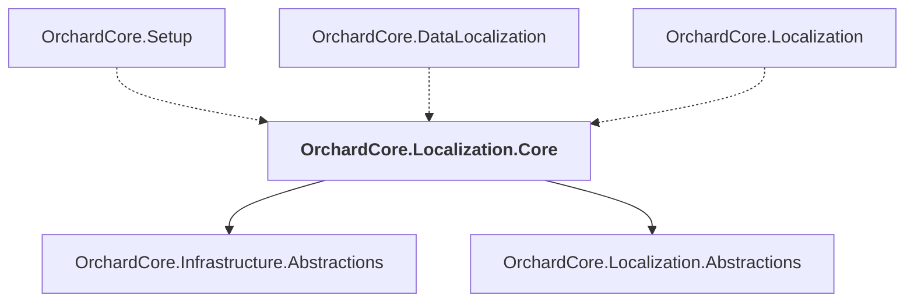

# OrchardCore.Localization.Core

## Overview

| Property | Value |
|----------|-------|
| Category | Localization |
| Repository | src |
| Path | `OrchardCore/OrchardCore.Localization.Core/OrchardCore.Localization.Core.csproj` |
| Project References | 2 |
| NuGet Dependencies | 1 |
| Consumers | 3 |

## Dependency Diagram

## Project References
- OrchardCore.Infrastructure.Abstractions
- OrchardCore.Localization.Abstractions

## Consumed By
- OrchardCore.Setup
- OrchardCore.DataLocalization
- OrchardCore.Localization

## External NuGet Packages
| Package | Version |
|---------|---------||
| ZString |  |

---

*[Back to Index](../../index.md)*
