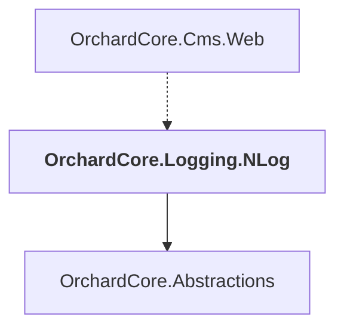

# OrchardCore.Logging.NLog

## Overview

| Property | Value |
|----------|-------|
| Category | Library |
| Repository | src |
| Path | `OrchardCore/OrchardCore.Logging.NLog/OrchardCore.Logging.NLog.csproj` |
| Project References | 1 |
| NuGet Dependencies | 1 |
| Consumers | 1 |

## Dependency Diagram

## Project References
- OrchardCore.Abstractions

## Consumed By
- OrchardCore.Cms.Web

## External NuGet Packages
| Package | Version |
|---------|---------||
| NLog.Web.AspNetCore |  |

---

*[Back to Index](../../index.md)*
