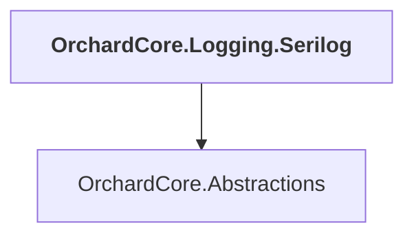

# OrchardCore.Logging.Serilog

## Overview

| Property | Value |
|----------|-------|
| Category | Library |
| Repository | src |
| Path | `OrchardCore/OrchardCore.Logging.Serilog/OrchardCore.Logging.Serilog.csproj` |
| Project References | 1 |
| NuGet Dependencies | 1 |
| Consumers | 0 |

## Dependency Diagram

## Project References
- OrchardCore.Abstractions

## External NuGet Packages
| Package | Version |
|---------|---------||
| Serilog.AspNetCore |  |

---

*[Back to Index](../../index.md)*
