# OrchardCore.Markdown

## Overview

| Property | Value |
|----------|-------|
| Category | Library |
| Repository | src |
| Path | `OrchardCore.Modules/OrchardCore.Markdown/OrchardCore.Markdown.csproj` |
| Project References | 15 |
| NuGet Dependencies | 1 |
| Consumers | 1 |

## Dependency Diagram

```mermaid
graph TD
    OrchardCore_Markdown["<strong>OrchardCore.Markdown</strong>"]
    OrchardCore_Admin_Abstractions["OrchardCore.Admin.Abstractions"]
    OrchardCore_Markdown --> OrchardCore_Admin_Abstractions
    OrchardCore_Apis_GraphQL_Abstractions["OrchardCore.Apis.GraphQL.Abstractions"]
    OrchardCore_Markdown --> OrchardCore_Apis_GraphQL_Abstractions
    OrchardCore_ContentLocalization_Abstractions["OrchardCore.ContentLocalization.Abstractions"]
    OrchardCore_Markdown --> OrchardCore_ContentLocalization_Abstractions
    OrchardCore_ContentManagement_Abstractions["OrchardCore.ContentManagement.Abstractions"]
    OrchardCore_Markdown --> OrchardCore_ContentManagement_Abstractions
    OrchardCore_ContentManagement_Display["OrchardCore.ContentManagement.Display"]
    OrchardCore_Markdown --> OrchardCore_ContentManagement_Display
    OrchardCore_ContentTypes_Abstractions["OrchardCore.ContentTypes.Abstractions"]
    OrchardCore_Markdown --> OrchardCore_ContentTypes_Abstractions
    OrchardCore_Data_Abstractions["OrchardCore.Data.Abstractions"]
    OrchardCore_Markdown --> OrchardCore_Data_Abstractions
    OrchardCore_DisplayManagement["OrchardCore.DisplayManagement"]
    OrchardCore_Markdown --> OrchardCore_DisplayManagement
    OrchardCore_Indexing_Abstractions["OrchardCore.Indexing.Abstractions"]
    OrchardCore_Markdown --> OrchardCore_Indexing_Abstractions
    OrchardCore_Liquid_Abstractions["OrchardCore.Liquid.Abstractions"]
    OrchardCore_Markdown --> OrchardCore_Liquid_Abstractions
    OrchardCore_Markdown_Abstractions["OrchardCore.Markdown.Abstractions"]
    OrchardCore_Markdown --> OrchardCore_Markdown_Abstractions
    OrchardCore_MetaWeblog_Abstractions["OrchardCore.MetaWeblog.Abstractions"]
    OrchardCore_Markdown --> OrchardCore_MetaWeblog_Abstractions
    OrchardCore_Module_Targets["OrchardCore.Module.Targets"]
    OrchardCore_Markdown --> OrchardCore_Module_Targets
    OrchardCore_Shortcodes_Abstractions["OrchardCore.Shortcodes.Abstractions"]
    OrchardCore_Markdown --> OrchardCore_Shortcodes_Abstractions
    OrchardCore_ResourceManagement["OrchardCore.ResourceManagement"]
    OrchardCore_Markdown --> OrchardCore_ResourceManagement
    OrchardCore_Application_Cms_Core_Targets["OrchardCore.Application.Cms.Core.Targets"]
    OrchardCore_Application_Cms_Core_Targets -.-> OrchardCore_Markdown
```

## Project References
- OrchardCore.Admin.Abstractions
- OrchardCore.Apis.GraphQL.Abstractions
- OrchardCore.ContentLocalization.Abstractions
- OrchardCore.ContentManagement.Abstractions
- OrchardCore.ContentManagement.Display
- OrchardCore.ContentTypes.Abstractions
- OrchardCore.Data.Abstractions
- OrchardCore.DisplayManagement
- OrchardCore.Indexing.Abstractions
- OrchardCore.Liquid.Abstractions
- OrchardCore.Markdown.Abstractions
- OrchardCore.MetaWeblog.Abstractions
- OrchardCore.Module.Targets
- OrchardCore.Shortcodes.Abstractions
- OrchardCore.ResourceManagement

## Consumed By
- OrchardCore.Application.Cms.Core.Targets

## External NuGet Packages
| Package | Version |
|---------|---------||
| Markdig |  |

---

*[Back to Index](../../index.md)*
