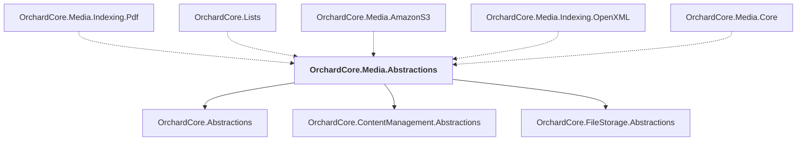

# OrchardCore.Media.Abstractions

## Overview

| Property | Value |
|----------|-------|
| Category | Library |
| Repository | src |
| Path | `OrchardCore/OrchardCore.Media.Abstractions/OrchardCore.Media.Abstractions.csproj` |
| Project References | 3 |
| NuGet Dependencies | 0 |
| Consumers | 5 |

## Dependency Diagram

## Project References
- OrchardCore.Abstractions
- OrchardCore.ContentManagement.Abstractions
- OrchardCore.FileStorage.Abstractions

## Consumed By
- OrchardCore.Media.Indexing.Pdf
- OrchardCore.Lists
- OrchardCore.Media.AmazonS3
- OrchardCore.Media.Indexing.OpenXML
- OrchardCore.Media.Core

---

*[Back to Index](../../index.md)*
