# OrchardCore.Media.AmazonS3

## Overview

| Property | Value |
|----------|-------|
| Category | Library |
| Repository | src |
| Path | `OrchardCore.Modules/OrchardCore.Media.AmazonS3/OrchardCore.Media.AmazonS3.csproj` |
| Project References | 9 |
| NuGet Dependencies | 1 |
| Consumers | 1 |

## Dependency Diagram

```mermaid
graph TD
    OrchardCore_Media_AmazonS3["<strong>OrchardCore.Media.AmazonS3</strong>"]
    OrchardCore_Admin_Abstractions["OrchardCore.Admin.Abstractions"]
    OrchardCore_Media_AmazonS3 --> OrchardCore_Admin_Abstractions
    OrchardCore_ContentManagement_Display["OrchardCore.ContentManagement.Display"]
    OrchardCore_Media_AmazonS3 --> OrchardCore_ContentManagement_Display
    OrchardCore_FileStorage_AmazonS3["OrchardCore.FileStorage.AmazonS3"]
    OrchardCore_Media_AmazonS3 --> OrchardCore_FileStorage_AmazonS3
    OrchardCore_Infrastructure_Abstractions["OrchardCore.Infrastructure.Abstractions"]
    OrchardCore_Media_AmazonS3 --> OrchardCore_Infrastructure_Abstractions
    OrchardCore_Media_Abstractions["OrchardCore.Media.Abstractions"]
    OrchardCore_Media_AmazonS3 --> OrchardCore_Media_Abstractions
    OrchardCore_Media_Core["OrchardCore.Media.Core"]
    OrchardCore_Media_AmazonS3 --> OrchardCore_Media_Core
    OrchardCore_Module_Targets["OrchardCore.Module.Targets"]
    OrchardCore_Media_AmazonS3 --> OrchardCore_Module_Targets
    OrchardCore_Navigation_Core["OrchardCore.Navigation.Core"]
    OrchardCore_Media_AmazonS3 --> OrchardCore_Navigation_Core
    OrchardCore_Media["OrchardCore.Media"]
    OrchardCore_Media_AmazonS3 --> OrchardCore_Media
    OrchardCore_Application_Cms_Core_Targets["OrchardCore.Application.Cms.Core.Targets"]
    OrchardCore_Application_Cms_Core_Targets -.-> OrchardCore_Media_AmazonS3
```

## Project References
- OrchardCore.Admin.Abstractions
- OrchardCore.ContentManagement.Display
- OrchardCore.FileStorage.AmazonS3
- OrchardCore.Infrastructure.Abstractions
- OrchardCore.Media.Abstractions
- OrchardCore.Media.Core
- OrchardCore.Module.Targets
- OrchardCore.Navigation.Core
- OrchardCore.Media

## Consumed By
- OrchardCore.Application.Cms.Core.Targets

## External NuGet Packages
| Package | Version |
|---------|---------||
| SixLabors.ImageSharp.Web.Providers.AWS |  |

---

*[Back to Index](../../index.md)*
