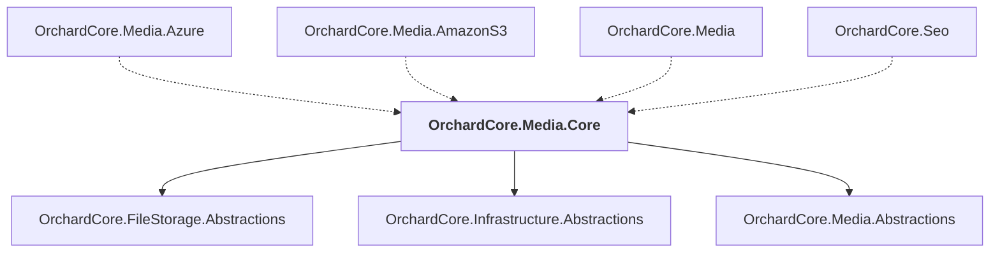

# OrchardCore.Media.Core

## Overview

| Property | Value |
|----------|-------|
| Category | Library |
| Repository | src |
| Path | `OrchardCore/OrchardCore.Media.Core/OrchardCore.Media.Core.csproj` |
| Project References | 3 |
| NuGet Dependencies | 0 |
| Consumers | 4 |

## Dependency Diagram

## Project References
- OrchardCore.FileStorage.Abstractions
- OrchardCore.Infrastructure.Abstractions
- OrchardCore.Media.Abstractions

## Consumed By
- OrchardCore.Media.Azure
- OrchardCore.Media.AmazonS3
- OrchardCore.Media
- OrchardCore.Seo

---

*[Back to Index](../../index.md)*
