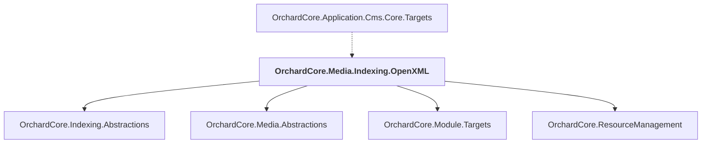

# OrchardCore.Media.Indexing.OpenXML

## Overview

| Property | Value |
|----------|-------|
| Category | Library |
| Repository | src |
| Path | `OrchardCore.Modules/OrchardCore.Media.Indexing.OpenXML/OrchardCore.Media.Indexing.OpenXML.csproj` |
| Project References | 4 |
| NuGet Dependencies | 1 |
| Consumers | 1 |

## Dependency Diagram

## Project References
- OrchardCore.Indexing.Abstractions
- OrchardCore.Media.Abstractions
- OrchardCore.Module.Targets
- OrchardCore.ResourceManagement

## Consumed By
- OrchardCore.Application.Cms.Core.Targets

## External NuGet Packages
| Package | Version |
|---------|---------||
| DocumentFormat.OpenXml |  |

---

*[Back to Index](../../index.md)*
