# OrchardCore.Media

## Overview

| Property | Value |
|----------|-------|
| Category | Library |
| Repository | src |
| Path | `OrchardCore.Modules/OrchardCore.Media/OrchardCore.Media.csproj` |
| Project References | 21 |
| NuGet Dependencies | 3 |
| Consumers | 3 |

## Dependency Diagram

```mermaid
graph TD
    OrchardCore_Media["<strong>OrchardCore.Media</strong>"]
    OrchardCore_Admin_Abstractions["OrchardCore.Admin.Abstractions"]
    OrchardCore_Media --> OrchardCore_Admin_Abstractions
    OrchardCore_Apis_GraphQL_Abstractions["OrchardCore.Apis.GraphQL.Abstractions"]
    OrchardCore_Media --> OrchardCore_Apis_GraphQL_Abstractions
    OrchardCore_ContentManagement_Abstractions["OrchardCore.ContentManagement.Abstractions"]
    OrchardCore_Media --> OrchardCore_ContentManagement_Abstractions
    OrchardCore_ContentManagement_Display["OrchardCore.ContentManagement.Display"]
    OrchardCore_Media --> OrchardCore_ContentManagement_Display
    OrchardCore_ContentManagement_GraphQL["OrchardCore.ContentManagement.GraphQL"]
    OrchardCore_Media --> OrchardCore_ContentManagement_GraphQL
    OrchardCore_ContentPreview_Abstractions["OrchardCore.ContentPreview.Abstractions"]
    OrchardCore_Media --> OrchardCore_ContentPreview_Abstractions
    OrchardCore_ContentTypes_Abstractions["OrchardCore.ContentTypes.Abstractions"]
    OrchardCore_Media --> OrchardCore_ContentTypes_Abstractions
    OrchardCore_Data_Abstractions["OrchardCore.Data.Abstractions"]
    OrchardCore_Media --> OrchardCore_Data_Abstractions
    OrchardCore_Deployment_Abstractions["OrchardCore.Deployment.Abstractions"]
    OrchardCore_Media --> OrchardCore_Deployment_Abstractions
    OrchardCore_DisplayManagement_Liquid["OrchardCore.DisplayManagement.Liquid"]
    OrchardCore_Media --> OrchardCore_DisplayManagement_Liquid
    OrchardCore_FileStorage_FileSystem["OrchardCore.FileStorage.FileSystem"]
    OrchardCore_Media --> OrchardCore_FileStorage_FileSystem
    OrchardCore_Indexing_Abstractions["OrchardCore.Indexing.Abstractions"]
    OrchardCore_Media --> OrchardCore_Indexing_Abstractions
    OrchardCore_Liquid_Abstractions["OrchardCore.Liquid.Abstractions"]
    OrchardCore_Media --> OrchardCore_Liquid_Abstractions
    OrchardCore_Media_Core["OrchardCore.Media.Core"]
    OrchardCore_Media --> OrchardCore_Media_Core
    OrchardCore_MetaWeblog_Abstractions["OrchardCore.MetaWeblog.Abstractions"]
    OrchardCore_Media --> OrchardCore_MetaWeblog_Abstractions
    OrchardCore_Module_Targets["OrchardCore.Module.Targets"]
    OrchardCore_Media --> OrchardCore_Module_Targets
    OrchardCore_Navigation_Core["OrchardCore.Navigation.Core"]
    OrchardCore_Media --> OrchardCore_Navigation_Core
    OrchardCore_Recipes_Abstractions["OrchardCore.Recipes.Abstractions"]
    OrchardCore_Media --> OrchardCore_Recipes_Abstractions
    OrchardCore_ResourceManagement["OrchardCore.ResourceManagement"]
    OrchardCore_Media --> OrchardCore_ResourceManagement
    OrchardCore_Shortcodes_Abstractions["OrchardCore.Shortcodes.Abstractions"]
    OrchardCore_Media --> OrchardCore_Shortcodes_Abstractions
    OrchardCore_XmlRpc_Abstractions["OrchardCore.XmlRpc.Abstractions"]
    OrchardCore_Media --> OrchardCore_XmlRpc_Abstractions
    OrchardCore_Media_Azure["OrchardCore.Media.Azure"]
    OrchardCore_Media_Azure -.-> OrchardCore_Media
    OrchardCore_Media_AmazonS3["OrchardCore.Media.AmazonS3"]
    OrchardCore_Media_AmazonS3 -.-> OrchardCore_Media
    OrchardCore_Application_Cms_Core_Targets["OrchardCore.Application.Cms.Core.Targets"]
    OrchardCore_Application_Cms_Core_Targets -.-> OrchardCore_Media
```

## Project References
- OrchardCore.Admin.Abstractions
- OrchardCore.Apis.GraphQL.Abstractions
- OrchardCore.ContentManagement.Abstractions
- OrchardCore.ContentManagement.Display
- OrchardCore.ContentManagement.GraphQL
- OrchardCore.ContentPreview.Abstractions
- OrchardCore.ContentTypes.Abstractions
- OrchardCore.Data.Abstractions
- OrchardCore.Deployment.Abstractions
- OrchardCore.DisplayManagement.Liquid
- OrchardCore.FileStorage.FileSystem
- OrchardCore.Indexing.Abstractions
- OrchardCore.Liquid.Abstractions
- OrchardCore.Media.Core
- OrchardCore.MetaWeblog.Abstractions
- OrchardCore.Module.Targets
- OrchardCore.Navigation.Core
- OrchardCore.Recipes.Abstractions
- OrchardCore.ResourceManagement
- OrchardCore.Shortcodes.Abstractions
- OrchardCore.XmlRpc.Abstractions

## Consumed By
- OrchardCore.Media.Azure
- OrchardCore.Media.AmazonS3
- OrchardCore.Application.Cms.Core.Targets

## External NuGet Packages
| Package | Version |
|---------|---------||
| Shortcodes |  |
| SixLabors.ImageSharp.Web |  |
| System.IO.Hashing |  |

---

*[Back to Index](../../index.md)*
