# OrchardCore.Menu

## Overview

| Property | Value |
|----------|-------|
| Category | Library |
| Repository | src |
| Path | `OrchardCore.Modules/OrchardCore.Menu/OrchardCore.Menu.csproj` |
| Project References | 11 |
| NuGet Dependencies | 0 |
| Consumers | 2 |

## Dependency Diagram

```mermaid
graph TD
    OrchardCore_Menu["<strong>OrchardCore.Menu</strong>"]
    OrchardCore_Admin_Abstractions["OrchardCore.Admin.Abstractions"]
    OrchardCore_Menu --> OrchardCore_Admin_Abstractions
    OrchardCore_ContentManagement_Abstractions["OrchardCore.ContentManagement.Abstractions"]
    OrchardCore_Menu --> OrchardCore_ContentManagement_Abstractions
    OrchardCore_ContentManagement_GraphQL["OrchardCore.ContentManagement.GraphQL"]
    OrchardCore_Menu --> OrchardCore_ContentManagement_GraphQL
    OrchardCore_ContentManagement_Display["OrchardCore.ContentManagement.Display"]
    OrchardCore_Menu --> OrchardCore_ContentManagement_Display
    OrchardCore_ContentTypes_Abstractions["OrchardCore.ContentTypes.Abstractions"]
    OrchardCore_Menu --> OrchardCore_ContentTypes_Abstractions
    OrchardCore_Data_Abstractions["OrchardCore.Data.Abstractions"]
    OrchardCore_Menu --> OrchardCore_Data_Abstractions
    OrchardCore_DisplayManagement["OrchardCore.DisplayManagement"]
    OrchardCore_Menu --> OrchardCore_DisplayManagement
    OrchardCore_Module_Targets["OrchardCore.Module.Targets"]
    OrchardCore_Menu --> OrchardCore_Module_Targets
    OrchardCore_Navigation_Core["OrchardCore.Navigation.Core"]
    OrchardCore_Menu --> OrchardCore_Navigation_Core
    OrchardCore_Recipes_Abstractions["OrchardCore.Recipes.Abstractions"]
    OrchardCore_Menu --> OrchardCore_Recipes_Abstractions
    OrchardCore_ResourceManagement["OrchardCore.ResourceManagement"]
    OrchardCore_Menu --> OrchardCore_ResourceManagement
    TheTheme["TheTheme"]
    TheTheme -.-> OrchardCore_Menu
    OrchardCore_Application_Cms_Core_Targets["OrchardCore.Application.Cms.Core.Targets"]
    OrchardCore_Application_Cms_Core_Targets -.-> OrchardCore_Menu
```

## Project References
- OrchardCore.Admin.Abstractions
- OrchardCore.ContentManagement.Abstractions
- OrchardCore.ContentManagement.GraphQL
- OrchardCore.ContentManagement.Display
- OrchardCore.ContentTypes.Abstractions
- OrchardCore.Data.Abstractions
- OrchardCore.DisplayManagement
- OrchardCore.Module.Targets
- OrchardCore.Navigation.Core
- OrchardCore.Recipes.Abstractions
- OrchardCore.ResourceManagement

## Consumed By
- TheTheme
- OrchardCore.Application.Cms.Core.Targets

---

*[Back to Index](../../index.md)*
