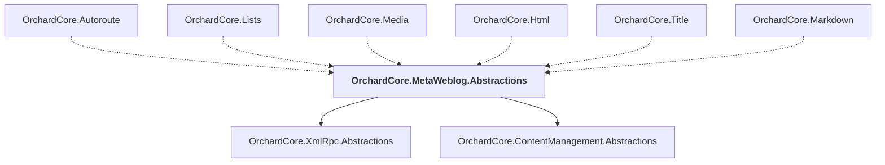

# OrchardCore.MetaWeblog.Abstractions

## Overview

| Property | Value |
|----------|-------|
| Category | Library |
| Repository | src |
| Path | `OrchardCore/OrchardCore.MetaWeblog.Abstractions/OrchardCore.MetaWeblog.Abstractions.csproj` |
| Project References | 2 |
| NuGet Dependencies | 0 |
| Consumers | 6 |

## Dependency Diagram

## Project References
- OrchardCore.XmlRpc.Abstractions
- OrchardCore.ContentManagement.Abstractions

## Consumed By
- OrchardCore.Autoroute
- OrchardCore.Lists
- OrchardCore.Media
- OrchardCore.Html
- OrchardCore.Title
- OrchardCore.Markdown

---

*[Back to Index](../../index.md)*
