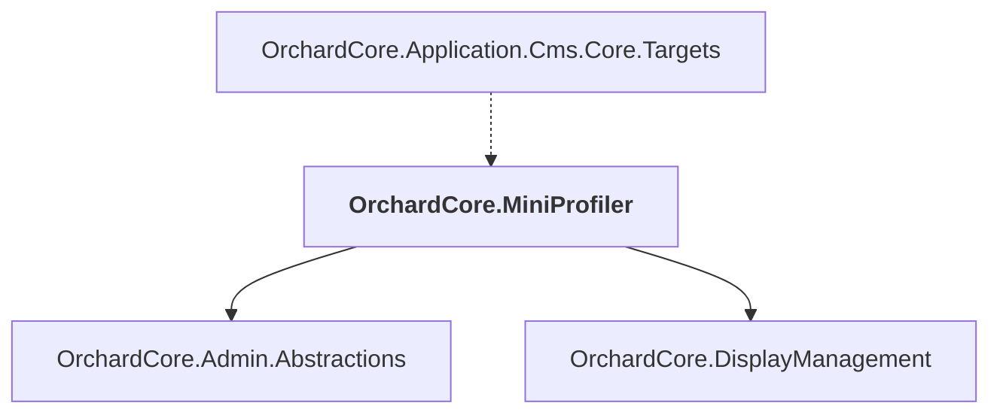

# OrchardCore.MiniProfiler

## Overview

| Property | Value |
|----------|-------|
| Category | Library |
| Repository | src |
| Path | `OrchardCore.Modules/OrchardCore.MiniProfiler/OrchardCore.MiniProfiler.csproj` |
| Project References | 2 |
| NuGet Dependencies | 2 |
| Consumers | 1 |

## Dependency Diagram

## Project References
- OrchardCore.Admin.Abstractions
- OrchardCore.DisplayManagement

## Consumed By
- OrchardCore.Application.Cms.Core.Targets

## External NuGet Packages
| Package | Version |
|---------|---------||
| MiniProfiler.AspNetCore.Mvc |  |
| YesSql.Abstractions |  |

---

*[Back to Index](../../index.md)*
