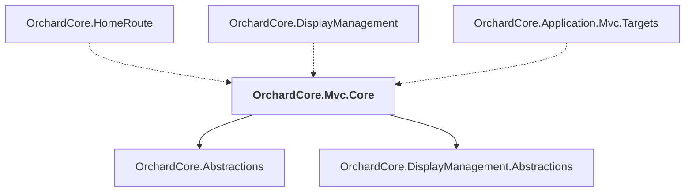

# OrchardCore.Mvc.Core

## Overview

| Property | Value |
|----------|-------|
| Category | Library |
| Repository | src |
| Path | `OrchardCore/OrchardCore.Mvc.Core/OrchardCore.Mvc.Core.csproj` |
| Project References | 2 |
| NuGet Dependencies | 1 |
| Consumers | 3 |

## Dependency Diagram

## Project References
- OrchardCore.Abstractions
- OrchardCore.DisplayManagement.Abstractions

## Consumed By
- OrchardCore.HomeRoute
- OrchardCore.DisplayManagement
- OrchardCore.Application.Mvc.Targets

## External NuGet Packages
| Package | Version |
|---------|---------||
| Microsoft.AspNetCore.Mvc.Razor.RuntimeCompilation |  |

---

*[Back to Index](../../index.md)*
