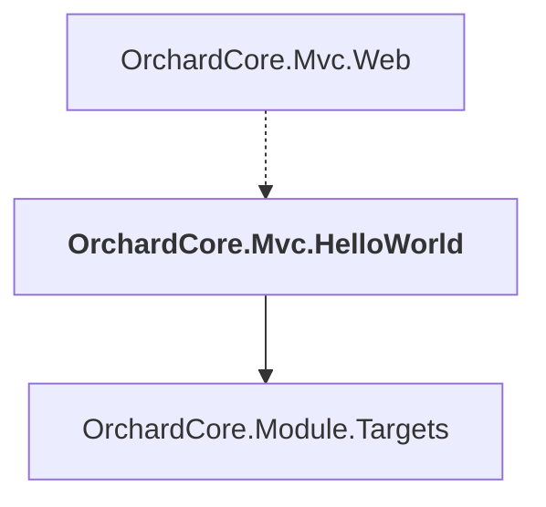

# OrchardCore.Mvc.HelloWorld

## Overview

| Property | Value |
|----------|-------|
| Category | Library |
| Repository | src |
| Path | `OrchardCore.Modules/OrchardCore.Mvc.HelloWorld/OrchardCore.Mvc.HelloWorld.csproj` |
| Project References | 1 |
| NuGet Dependencies | 0 |
| Consumers | 1 |

## Dependency Diagram

## Project References
- OrchardCore.Module.Targets

## Consumed By
- OrchardCore.Mvc.Web

---

*[Back to Index](../../index.md)*
