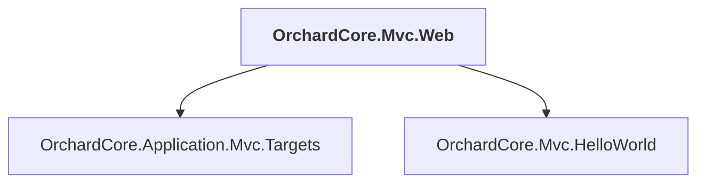

# OrchardCore.Mvc.Web

## Overview

| Property | Value |
|----------|-------|
| Category | WebApp |
| Repository | src |
| Path | `OrchardCore.Mvc.Web/OrchardCore.Mvc.Web.csproj` |
| Project References | 2 |
| NuGet Dependencies | 0 |
| Consumers | 0 |

## Dependency Diagram

## Project References
- OrchardCore.Application.Mvc.Targets
- OrchardCore.Mvc.HelloWorld

---

*[Back to Index](../../index.md)*
