# OrchardCore.Navigation.Core

## Overview

| Property | Value |
|----------|-------|
| Category | Library |
| Repository | src |
| Path | `OrchardCore/OrchardCore.Navigation.Core/OrchardCore.Navigation.Core.csproj` |
| Project References | 3 |
| NuGet Dependencies | 0 |
| Consumers | 61 |

## Dependency Diagram

```mermaid
graph TD
    OrchardCore_Navigation_Core["<strong>OrchardCore.Navigation.Core</strong>"]
    OrchardCore_Admin_Abstractions["OrchardCore.Admin.Abstractions"]
    OrchardCore_Navigation_Core --> OrchardCore_Admin_Abstractions
    OrchardCore_DisplayManagement["OrchardCore.DisplayManagement"]
    OrchardCore_Navigation_Core --> OrchardCore_DisplayManagement
    OrchardCore_Infrastructure_Abstractions["OrchardCore.Infrastructure.Abstractions"]
    OrchardCore_Navigation_Core --> OrchardCore_Infrastructure_Abstractions
    OrchardCore_Queries["OrchardCore.Queries"]
    OrchardCore_Queries -.-> OrchardCore_Navigation_Core
    OrchardCore_AdminMenu["OrchardCore.AdminMenu"]
    OrchardCore_AdminMenu -.-> OrchardCore_Navigation_Core
    OrchardCore_Deployment["OrchardCore.Deployment"]
    OrchardCore_Deployment -.-> OrchardCore_Navigation_Core
    OrchardCore_Shortcodes["OrchardCore.Shortcodes"]
    OrchardCore_Shortcodes -.-> OrchardCore_Navigation_Core
    OrchardCore_AuditTrail["OrchardCore.AuditTrail"]
    OrchardCore_AuditTrail -.-> OrchardCore_Navigation_Core
    OrchardCore_Email_Azure["OrchardCore.Email.Azure"]
    OrchardCore_Email_Azure -.-> OrchardCore_Navigation_Core
    OrchardCore_Twitter["OrchardCore.Twitter"]
    OrchardCore_Twitter -.-> OrchardCore_Navigation_Core
    OrchardCore_BackgroundTasks["OrchardCore.BackgroundTasks"]
    OrchardCore_BackgroundTasks -.-> OrchardCore_Navigation_Core
    OrchardCore_Settings["OrchardCore.Settings"]
    OrchardCore_Settings -.-> OrchardCore_Navigation_Core
    OrchardCore_Navigation["OrchardCore.Navigation"]
    OrchardCore_Navigation -.-> OrchardCore_Navigation_Core
    OrchardCore_Features["OrchardCore.Features"]
    OrchardCore_Features -.-> OrchardCore_Navigation_Core
    OrchardCore_Media_Azure["OrchardCore.Media.Azure"]
    OrchardCore_Media_Azure -.-> OrchardCore_Navigation_Core
    OrchardCore_Taxonomies["OrchardCore.Taxonomies"]
    OrchardCore_Taxonomies -.-> OrchardCore_Navigation_Core
    OrchardCore_Sms["OrchardCore.Sms"]
    OrchardCore_Sms -.-> OrchardCore_Navigation_Core
    OrchardCore_Microsoft_Authentication["OrchardCore.Microsoft.Authentication"]
    OrchardCore_Microsoft_Authentication -.-> OrchardCore_Navigation_Core
    more_consumers["... +46 more"]
    more_consumers -.-> OrchardCore_Navigation_Core
```

## Project References
- OrchardCore.Admin.Abstractions
- OrchardCore.DisplayManagement
- OrchardCore.Infrastructure.Abstractions

## Consumed By
- OrchardCore.Queries
- OrchardCore.AdminMenu
- OrchardCore.Deployment
- OrchardCore.Shortcodes
- OrchardCore.AuditTrail
- OrchardCore.Email.Azure
- OrchardCore.Twitter
- OrchardCore.BackgroundTasks
- OrchardCore.Settings
- OrchardCore.Navigation
- OrchardCore.Features
- OrchardCore.Media.Azure
- OrchardCore.Taxonomies
- OrchardCore.Sms
- OrchardCore.Microsoft.Authentication
- OrchardCore.Workflows
- OrchardCore.Google
- OrchardCore.Users
- OrchardCore.Search.Elasticsearch
- OrchardCore.Themes
- OrchardCore.OpenId
- OrchardCore.Notifications
- OrchardCore.AdminDashboard
- OrchardCore.Admin
- OrchardCore.ReverseProxy
- OrchardCore.DataLocalization
- OrchardCore.GitHub
- OrchardCore.Menu
- OrchardCore.Security
- OrchardCore.Contents
- OrchardCore.Media.AmazonS3
- OrchardCore.Facebook
- OrchardCore.Layers
- OrchardCore.Search.Lucene
- OrchardCore.Localization
- OrchardCore.Deployment.Remote
- OrchardCore.Media
- OrchardCore.Sitemaps
- OrchardCore.Seo
- OrchardCore.Roles
- OrchardCore.Email
- OrchardCore.Https
- OrchardCore.Recipes
- OrchardCore.UrlRewriting
- OrchardCore.Search
- OrchardCore.Demo
- OrchardCore.Apis.GraphQL
- OrchardCore.CustomSettings
- OrchardCore.Email.Smtp
- OrchardCore.Templates
- OrchardCore.Cors
- OrchardCore.Indexing
- OrchardCore.ContentLocalization
- OrchardCore.ReCaptcha
- OrchardCore.Forms
- OrchardCore.Search.AzureAI
- OrchardCore.ContentTypes
- OrchardCore.Tenants
- OrchardCore.Placements
- OrchardCore.AdminMenu.Abstractions
- OrchardCore.Taxonomies.Core

---

*[Back to Index](../../index.md)*
