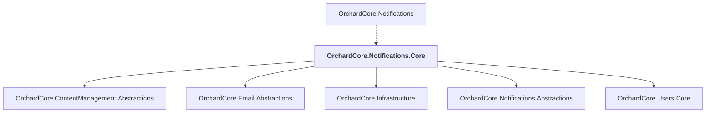

# OrchardCore.Notifications.Core

## Overview

| Property | Value |
|----------|-------|
| Category | Library |
| Repository | src |
| Path | `OrchardCore/OrchardCore.Notifications.Core/OrchardCore.Notifications.Core.csproj` |
| Project References | 5 |
| NuGet Dependencies | 0 |
| Consumers | 1 |

## Dependency Diagram

## Project References
- OrchardCore.ContentManagement.Abstractions
- OrchardCore.Email.Abstractions
- OrchardCore.Infrastructure
- OrchardCore.Notifications.Abstractions
- OrchardCore.Users.Core

## Consumed By
- OrchardCore.Notifications

---

*[Back to Index](../../index.md)*
