# OrchardCore.Notifications

## Overview

| Property | Value |
|----------|-------|
| Category | Library |
| Repository | src |
| Path | `OrchardCore.Modules/OrchardCore.Notifications/OrchardCore.Notifications.csproj` |
| Project References | 10 |
| NuGet Dependencies | 0 |
| Consumers | 2 |

## Dependency Diagram

```mermaid
graph TD
    OrchardCore_Notifications["<strong>OrchardCore.Notifications</strong>"]
    OrchardCore_Admin_Abstractions["OrchardCore.Admin.Abstractions"]
    OrchardCore_Notifications --> OrchardCore_Admin_Abstractions
    OrchardCore_ContentManagement_Display["OrchardCore.ContentManagement.Display"]
    OrchardCore_Notifications --> OrchardCore_ContentManagement_Display
    OrchardCore_ContentManagement["OrchardCore.ContentManagement"]
    OrchardCore_Notifications --> OrchardCore_ContentManagement
    OrchardCore_Contents_Core["OrchardCore.Contents.Core"]
    OrchardCore_Notifications --> OrchardCore_Contents_Core
    OrchardCore_Module_Targets["OrchardCore.Module.Targets"]
    OrchardCore_Notifications --> OrchardCore_Module_Targets
    OrchardCore_Navigation_Core["OrchardCore.Navigation.Core"]
    OrchardCore_Notifications --> OrchardCore_Navigation_Core
    OrchardCore_Notifications_Core["OrchardCore.Notifications.Core"]
    OrchardCore_Notifications --> OrchardCore_Notifications_Core
    OrchardCore_ResourceManagement["OrchardCore.ResourceManagement"]
    OrchardCore_Notifications --> OrchardCore_ResourceManagement
    OrchardCore_Users_Core["OrchardCore.Users.Core"]
    OrchardCore_Notifications --> OrchardCore_Users_Core
    OrchardCore_Workflows_Abstractions["OrchardCore.Workflows.Abstractions"]
    OrchardCore_Notifications --> OrchardCore_Workflows_Abstractions
    TheTheme["TheTheme"]
    TheTheme -.-> OrchardCore_Notifications
    OrchardCore_Application_Cms_Core_Targets["OrchardCore.Application.Cms.Core.Targets"]
    OrchardCore_Application_Cms_Core_Targets -.-> OrchardCore_Notifications
```

## Project References
- OrchardCore.Admin.Abstractions
- OrchardCore.ContentManagement.Display
- OrchardCore.ContentManagement
- OrchardCore.Contents.Core
- OrchardCore.Module.Targets
- OrchardCore.Navigation.Core
- OrchardCore.Notifications.Core
- OrchardCore.ResourceManagement
- OrchardCore.Users.Core
- OrchardCore.Workflows.Abstractions

## Consumed By
- TheTheme
- OrchardCore.Application.Cms.Core.Targets

---

*[Back to Index](../../index.md)*
