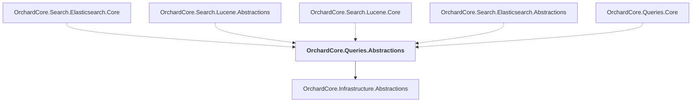

# OrchardCore.Queries.Abstractions

## Overview

| Property | Value |
|----------|-------|
| Category | Library |
| Repository | src |
| Path | `OrchardCore/OrchardCore.Queries.Abstractions/OrchardCore.Queries.Abstractions.csproj` |
| Project References | 1 |
| NuGet Dependencies | 0 |
| Consumers | 5 |

## Dependency Diagram

## Project References
- OrchardCore.Infrastructure.Abstractions

## Consumed By
- OrchardCore.Search.Elasticsearch.Core
- OrchardCore.Search.Lucene.Abstractions
- OrchardCore.Search.Lucene.Core
- OrchardCore.Search.Elasticsearch.Abstractions
- OrchardCore.Queries.Core

---

*[Back to Index](../../index.md)*
