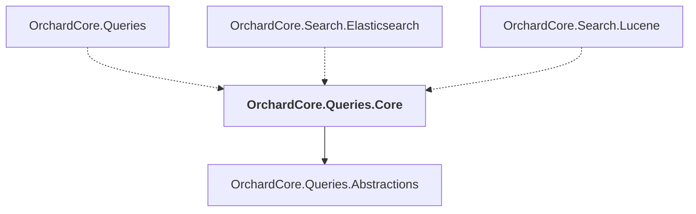

# OrchardCore.Queries.Core

## Overview

| Property | Value |
|----------|-------|
| Category | Library |
| Repository | src |
| Path | `OrchardCore/OrchardCore.Queries.Core/OrchardCore.Queries.Core.csproj` |
| Project References | 1 |
| NuGet Dependencies | 1 |
| Consumers | 3 |

## Dependency Diagram

## Project References
- OrchardCore.Queries.Abstractions

## Consumed By
- OrchardCore.Queries
- OrchardCore.Search.Elasticsearch
- OrchardCore.Search.Lucene

## External NuGet Packages
| Package | Version |
|---------|---------||
| YesSql.Core |  |

---

*[Back to Index](../../index.md)*
