# OrchardCore.Queries

## Overview

| Property | Value |
|----------|-------|
| Category | Library |
| Repository | src |
| Path | `OrchardCore.Modules/OrchardCore.Queries/OrchardCore.Queries.csproj` |
| Project References | 13 |
| NuGet Dependencies | 1 |
| Consumers | 2 |

## Dependency Diagram

```mermaid
graph TD
    OrchardCore_Queries["<strong>OrchardCore.Queries</strong>"]
    OrchardCore_Admin_Abstractions["OrchardCore.Admin.Abstractions"]
    OrchardCore_Queries --> OrchardCore_Admin_Abstractions
    OrchardCore_ContentManagement_Abstractions["OrchardCore.ContentManagement.Abstractions"]
    OrchardCore_Queries --> OrchardCore_ContentManagement_Abstractions
    OrchardCore_ContentManagement_Display["OrchardCore.ContentManagement.Display"]
    OrchardCore_Queries --> OrchardCore_ContentManagement_Display
    OrchardCore_ContentManagement_GraphQL["OrchardCore.ContentManagement.GraphQL"]
    OrchardCore_Queries --> OrchardCore_ContentManagement_GraphQL
    OrchardCore_Data_Abstractions["OrchardCore.Data.Abstractions"]
    OrchardCore_Queries --> OrchardCore_Data_Abstractions
    OrchardCore_Deployment_Abstractions["OrchardCore.Deployment.Abstractions"]
    OrchardCore_Queries --> OrchardCore_Deployment_Abstractions
    OrchardCore_DisplayManagement["OrchardCore.DisplayManagement"]
    OrchardCore_Queries --> OrchardCore_DisplayManagement
    OrchardCore_Localization_Abstractions["OrchardCore.Localization.Abstractions"]
    OrchardCore_Queries --> OrchardCore_Localization_Abstractions
    OrchardCore_Liquid_Abstractions["OrchardCore.Liquid.Abstractions"]
    OrchardCore_Queries --> OrchardCore_Liquid_Abstractions
    OrchardCore_Module_Targets["OrchardCore.Module.Targets"]
    OrchardCore_Queries --> OrchardCore_Module_Targets
    OrchardCore_Navigation_Core["OrchardCore.Navigation.Core"]
    OrchardCore_Queries --> OrchardCore_Navigation_Core
    OrchardCore_Queries_Core["OrchardCore.Queries.Core"]
    OrchardCore_Queries --> OrchardCore_Queries_Core
    OrchardCore_ResourceManagement["OrchardCore.ResourceManagement"]
    OrchardCore_Queries --> OrchardCore_ResourceManagement
    TheBlogTheme["TheBlogTheme"]
    TheBlogTheme -.-> OrchardCore_Queries
    OrchardCore_Application_Cms_Core_Targets["OrchardCore.Application.Cms.Core.Targets"]
    OrchardCore_Application_Cms_Core_Targets -.-> OrchardCore_Queries
```

## Project References
- OrchardCore.Admin.Abstractions
- OrchardCore.ContentManagement.Abstractions
- OrchardCore.ContentManagement.Display
- OrchardCore.ContentManagement.GraphQL
- OrchardCore.Data.Abstractions
- OrchardCore.Deployment.Abstractions
- OrchardCore.DisplayManagement
- OrchardCore.Localization.Abstractions
- OrchardCore.Liquid.Abstractions
- OrchardCore.Module.Targets
- OrchardCore.Navigation.Core
- OrchardCore.Queries.Core
- OrchardCore.ResourceManagement

## Consumed By
- TheBlogTheme
- OrchardCore.Application.Cms.Core.Targets

## External NuGet Packages
| Package | Version |
|---------|---------||
| Parlot |  |

---

*[Back to Index](../../index.md)*
