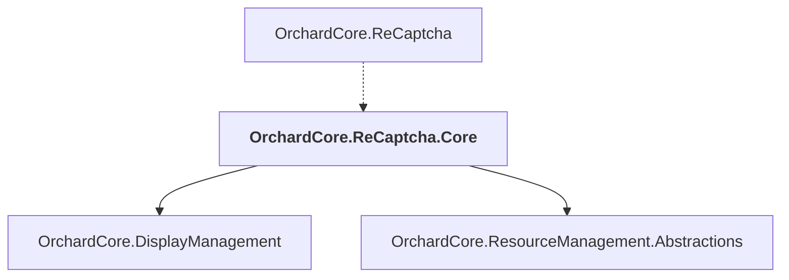

# OrchardCore.ReCaptcha.Core

## Overview

| Property | Value |
|----------|-------|
| Category | Library |
| Repository | src |
| Path | `OrchardCore/OrchardCore.ReCaptcha.Core/OrchardCore.ReCaptcha.Core.csproj` |
| Project References | 2 |
| NuGet Dependencies | 1 |
| Consumers | 1 |

## Dependency Diagram

## Project References
- OrchardCore.DisplayManagement
- OrchardCore.ResourceManagement.Abstractions

## Consumed By
- OrchardCore.ReCaptcha

## External NuGet Packages
| Package | Version |
|---------|---------||
| Microsoft.Extensions.Http.Resilience |  |

---

*[Back to Index](../../index.md)*
