# OrchardCore.ReCaptcha

## Overview

| Property | Value |
|----------|-------|
| Category | Library |
| Repository | src |
| Path | `OrchardCore.Modules/OrchardCore.ReCaptcha/OrchardCore.ReCaptcha.csproj` |
| Project References | 9 |
| NuGet Dependencies | 0 |
| Consumers | 1 |

## Dependency Diagram

```mermaid
graph TD
    OrchardCore_ReCaptcha["<strong>OrchardCore.ReCaptcha</strong>"]
    OrchardCore_ContentManagement_Abstractions["OrchardCore.ContentManagement.Abstractions"]
    OrchardCore_ReCaptcha --> OrchardCore_ContentManagement_Abstractions
    OrchardCore_ContentManagement_Display["OrchardCore.ContentManagement.Display"]
    OrchardCore_ReCaptcha --> OrchardCore_ContentManagement_Display
    OrchardCore_Module_Targets["OrchardCore.Module.Targets"]
    OrchardCore_ReCaptcha --> OrchardCore_Module_Targets
    OrchardCore_Navigation_Core["OrchardCore.Navigation.Core"]
    OrchardCore_ReCaptcha --> OrchardCore_Navigation_Core
    OrchardCore_ReCaptcha_Core["OrchardCore.ReCaptcha.Core"]
    OrchardCore_ReCaptcha --> OrchardCore_ReCaptcha_Core
    OrchardCore_Settings_Core["OrchardCore.Settings.Core"]
    OrchardCore_ReCaptcha --> OrchardCore_Settings_Core
    OrchardCore_Users_Abstractions["OrchardCore.Users.Abstractions"]
    OrchardCore_ReCaptcha --> OrchardCore_Users_Abstractions
    OrchardCore_Users_Core["OrchardCore.Users.Core"]
    OrchardCore_ReCaptcha --> OrchardCore_Users_Core
    OrchardCore_Workflows_Abstractions["OrchardCore.Workflows.Abstractions"]
    OrchardCore_ReCaptcha --> OrchardCore_Workflows_Abstractions
    OrchardCore_Application_Cms_Core_Targets["OrchardCore.Application.Cms.Core.Targets"]
    OrchardCore_Application_Cms_Core_Targets -.-> OrchardCore_ReCaptcha
```

## Project References
- OrchardCore.ContentManagement.Abstractions
- OrchardCore.ContentManagement.Display
- OrchardCore.Module.Targets
- OrchardCore.Navigation.Core
- OrchardCore.ReCaptcha.Core
- OrchardCore.Settings.Core
- OrchardCore.Users.Abstractions
- OrchardCore.Users.Core
- OrchardCore.Workflows.Abstractions

## Consumed By
- OrchardCore.Application.Cms.Core.Targets

---

*[Back to Index](../../index.md)*
