# OrchardCore.Recipes.Abstractions

## Overview

| Property | Value |
|----------|-------|
| Category | Library |
| Repository | src |
| Path | `OrchardCore/OrchardCore.Recipes.Abstractions/OrchardCore.Recipes.Abstractions.csproj` |
| Project References | 1 |
| NuGet Dependencies | 0 |
| Consumers | 29 |

## Dependency Diagram

```mermaid
graph TD
    OrchardCore_Recipes_Abstractions["<strong>OrchardCore.Recipes.Abstractions</strong>"]
    OrchardCore_Data_YesSql_Abstractions["OrchardCore.Data.YesSql.Abstractions"]
    OrchardCore_Recipes_Abstractions --> OrchardCore_Data_YesSql_Abstractions
    OrchardCore_Twitter["OrchardCore.Twitter"]
    OrchardCore_Twitter -.-> OrchardCore_Recipes_Abstractions
    OrchardCore_Settings["OrchardCore.Settings"]
    OrchardCore_Settings -.-> OrchardCore_Recipes_Abstractions
    OrchardCore_Features["OrchardCore.Features"]
    OrchardCore_Features -.-> OrchardCore_Recipes_Abstractions
    OrchardCore_Setup["OrchardCore.Setup"]
    OrchardCore_Setup -.-> OrchardCore_Recipes_Abstractions
    OrchardCore_Microsoft_Authentication["OrchardCore.Microsoft.Authentication"]
    OrchardCore_Microsoft_Authentication -.-> OrchardCore_Recipes_Abstractions
    OrchardCore_Google["OrchardCore.Google"]
    OrchardCore_Google -.-> OrchardCore_Recipes_Abstractions
    OrchardCore_Users["OrchardCore.Users"]
    OrchardCore_Users -.-> OrchardCore_Recipes_Abstractions
    OrchardCore_Themes["OrchardCore.Themes"]
    OrchardCore_Themes -.-> OrchardCore_Recipes_Abstractions
    OrchardCore_OpenId["OrchardCore.OpenId"]
    OrchardCore_OpenId -.-> OrchardCore_Recipes_Abstractions
    OrchardCore_GitHub["OrchardCore.GitHub"]
    OrchardCore_GitHub -.-> OrchardCore_Recipes_Abstractions
    OrchardCore_Menu["OrchardCore.Menu"]
    OrchardCore_Menu -.-> OrchardCore_Recipes_Abstractions
    OrchardCore_Contents["OrchardCore.Contents"]
    OrchardCore_Contents -.-> OrchardCore_Recipes_Abstractions
    OrchardCore_Facebook["OrchardCore.Facebook"]
    OrchardCore_Facebook -.-> OrchardCore_Recipes_Abstractions
    OrchardCore_Layers["OrchardCore.Layers"]
    OrchardCore_Layers -.-> OrchardCore_Recipes_Abstractions
    OrchardCore_Search_Lucene["OrchardCore.Search.Lucene"]
    OrchardCore_Search_Lucene -.-> OrchardCore_Recipes_Abstractions
    more_consumers["... +14 more"]
    more_consumers -.-> OrchardCore_Recipes_Abstractions
```

## Project References
- OrchardCore.Data.YesSql.Abstractions

## Consumed By
- OrchardCore.Twitter
- OrchardCore.Settings
- OrchardCore.Features
- OrchardCore.Setup
- OrchardCore.Microsoft.Authentication
- OrchardCore.Google
- OrchardCore.Users
- OrchardCore.Themes
- OrchardCore.OpenId
- OrchardCore.GitHub
- OrchardCore.Menu
- OrchardCore.Contents
- OrchardCore.Facebook
- OrchardCore.Layers
- OrchardCore.Search.Lucene
- OrchardCore.Media
- OrchardCore.Seo
- OrchardCore.Roles
- OrchardCore.UrlRewriting
- OrchardCore.CustomSettings
- OrchardCore.Templates
- OrchardCore.Indexing
- OrchardCore.Tenants
- OrchardCore.Placements
- OrchardCore.Setup.Core
- OrchardCore.Recipes.Core
- OrchardCore.Deployment.Abstractions
- OrchardCore.Setup.Abstractions
- OrchardCore.ContentManagement

---

*[Back to Index](../../index.md)*
