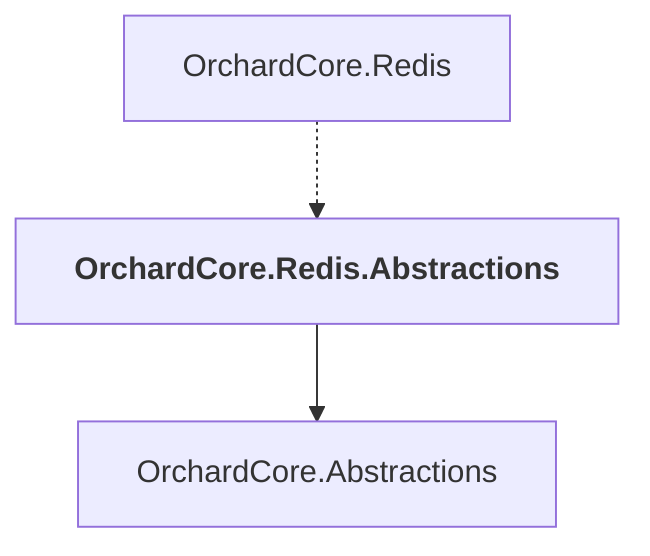

# OrchardCore.Redis.Abstractions

## Overview

| Property | Value |
|----------|-------|
| Category | Library |
| Repository | src |
| Path | `OrchardCore/OrchardCore.Redis.Abstractions/OrchardCore.Redis.Abstractions.csproj` |
| Project References | 1 |
| NuGet Dependencies | 3 |
| Consumers | 1 |

## Dependency Diagram

## Project References
- OrchardCore.Abstractions

## Consumed By
- OrchardCore.Redis

## External NuGet Packages
| Package | Version |
|---------|---------||
| Microsoft.AspNetCore.DataProtection.StackExchangeRedis |  |
| Microsoft.Extensions.Caching.StackExchangeRedis |  |
| StackExchange.Redis |  |

---

*[Back to Index](../../index.md)*
