# OrchardCore.ResourceManagement.Abstractions

## Overview

| Property | Value |
|----------|-------|
| Category | Library |
| Repository | src |
| Path | `OrchardCore/OrchardCore.ResourceManagement.Abstractions/OrchardCore.ResourceManagement.Abstractions.csproj` |
| Project References | 0 |
| NuGet Dependencies | 0 |
| Consumers | 8 |

## Dependency Diagram

```mermaid
graph TD
    OrchardCore_ResourceManagement_Abstractions["<strong>OrchardCore.ResourceManagement.Abstractions</strong>"]
    TheComingSoonTheme["TheComingSoonTheme"]
    TheComingSoonTheme -.-> OrchardCore_ResourceManagement_Abstractions
    TheBlogTheme["TheBlogTheme"]
    TheBlogTheme -.-> OrchardCore_ResourceManagement_Abstractions
    TheAgencyTheme["TheAgencyTheme"]
    TheAgencyTheme -.-> OrchardCore_ResourceManagement_Abstractions
    OrchardCore_Workflows["OrchardCore.Workflows"]
    OrchardCore_Workflows -.-> OrchardCore_ResourceManagement_Abstractions
    OrchardCore_Infrastructure_Abstractions["OrchardCore.Infrastructure.Abstractions"]
    OrchardCore_Infrastructure_Abstractions -.-> OrchardCore_ResourceManagement_Abstractions
    OrchardCore_ResourceManagement_Core["OrchardCore.ResourceManagement.Core"]
    OrchardCore_ResourceManagement_Core -.-> OrchardCore_ResourceManagement_Abstractions
    OrchardCore_DisplayManagement_Liquid["OrchardCore.DisplayManagement.Liquid"]
    OrchardCore_DisplayManagement_Liquid -.-> OrchardCore_ResourceManagement_Abstractions
    OrchardCore_ReCaptcha_Core["OrchardCore.ReCaptcha.Core"]
    OrchardCore_ReCaptcha_Core -.-> OrchardCore_ResourceManagement_Abstractions
```

## Consumed By
- TheComingSoonTheme
- TheBlogTheme
- TheAgencyTheme
- OrchardCore.Workflows
- OrchardCore.Infrastructure.Abstractions
- OrchardCore.ResourceManagement.Core
- OrchardCore.DisplayManagement.Liquid
- OrchardCore.ReCaptcha.Core

---

*[Back to Index](../../index.md)*
