# OrchardCore.ResourceManagement

## Overview

| Property | Value |
|----------|-------|
| Category | Library |
| Repository | src |
| Path | `OrchardCore/OrchardCore.ResourceManagement/OrchardCore.ResourceManagement.csproj` |
| Project References | 1 |
| NuGet Dependencies | 0 |
| Consumers | 68 |

## Dependency Diagram

```mermaid
graph TD
    OrchardCore_ResourceManagement["<strong>OrchardCore.ResourceManagement</strong>"]
    OrchardCore_ResourceManagement_Core["OrchardCore.ResourceManagement.Core"]
    OrchardCore_ResourceManagement --> OrchardCore_ResourceManagement_Core
    TheTheme["TheTheme"]
    TheTheme -.-> OrchardCore_ResourceManagement
    TheAdmin["TheAdmin"]
    TheAdmin -.-> OrchardCore_ResourceManagement
    OrchardCore_Queries["OrchardCore.Queries"]
    OrchardCore_Queries -.-> OrchardCore_ResourceManagement
    OrchardCore_AdminMenu["OrchardCore.AdminMenu"]
    OrchardCore_AdminMenu -.-> OrchardCore_ResourceManagement
    OrchardCore_Deployment["OrchardCore.Deployment"]
    OrchardCore_Deployment -.-> OrchardCore_ResourceManagement
    OrchardCore_Shortcodes["OrchardCore.Shortcodes"]
    OrchardCore_Shortcodes -.-> OrchardCore_ResourceManagement
    OrchardCore_AuditTrail["OrchardCore.AuditTrail"]
    OrchardCore_AuditTrail -.-> OrchardCore_ResourceManagement
    OrchardCore_ContentPreview["OrchardCore.ContentPreview"]
    OrchardCore_ContentPreview -.-> OrchardCore_ResourceManagement
    OrchardCore_Twitter["OrchardCore.Twitter"]
    OrchardCore_Twitter -.-> OrchardCore_ResourceManagement
    OrchardCore_BackgroundTasks["OrchardCore.BackgroundTasks"]
    OrchardCore_BackgroundTasks -.-> OrchardCore_ResourceManagement
    OrchardCore_Features["OrchardCore.Features"]
    OrchardCore_Features -.-> OrchardCore_ResourceManagement
    OrchardCore_Taxonomies["OrchardCore.Taxonomies"]
    OrchardCore_Taxonomies -.-> OrchardCore_ResourceManagement
    OrchardCore_Flows["OrchardCore.Flows"]
    OrchardCore_Flows -.-> OrchardCore_ResourceManagement
    OrchardCore_PublishLater["OrchardCore.PublishLater"]
    OrchardCore_PublishLater -.-> OrchardCore_ResourceManagement
    OrchardCore_Sms["OrchardCore.Sms"]
    OrchardCore_Sms -.-> OrchardCore_ResourceManagement
    more_consumers["... +53 more"]
    more_consumers -.-> OrchardCore_ResourceManagement
```

## Project References
- OrchardCore.ResourceManagement.Core

## Consumed By
- TheTheme
- TheAdmin
- OrchardCore.Queries
- OrchardCore.AdminMenu
- OrchardCore.Deployment
- OrchardCore.Shortcodes
- OrchardCore.AuditTrail
- OrchardCore.ContentPreview
- OrchardCore.Twitter
- OrchardCore.BackgroundTasks
- OrchardCore.Features
- OrchardCore.Taxonomies
- OrchardCore.Flows
- OrchardCore.PublishLater
- OrchardCore.Sms
- OrchardCore.Microsoft.Authentication
- OrchardCore.ArchiveLater
- OrchardCore.Workflows
- OrchardCore.Google
- OrchardCore.Users
- OrchardCore.Search.Elasticsearch
- OrchardCore.Media.Indexing.Pdf
- OrchardCore.Themes
- OrchardCore.ContentFields
- OrchardCore.OpenId
- OrchardCore.Notifications
- OrchardCore.Rules
- OrchardCore.AdminDashboard
- OrchardCore.Admin
- OrchardCore.DataLocalization
- OrchardCore.Autoroute
- OrchardCore.GitHub
- OrchardCore.Menu
- OrchardCore.Alias
- OrchardCore.Liquid
- OrchardCore.Lists
- OrchardCore.Contents
- OrchardCore.Facebook
- OrchardCore.Layers
- OrchardCore.Search.Lucene
- OrchardCore.Localization
- OrchardCore.Deployment.Remote
- OrchardCore.Media
- OrchardCore.Sitemaps
- OrchardCore.Seo
- OrchardCore.Media.Indexing.OpenXML
- OrchardCore.Html
- OrchardCore.Roles
- OrchardCore.Email
- OrchardCore.Title
- OrchardCore.Recipes
- OrchardCore.Markdown
- OrchardCore.UrlRewriting
- OrchardCore.Demo
- OrchardCore.Apis.GraphQL
- OrchardCore.CustomSettings
- OrchardCore.Widgets
- OrchardCore.Email.Smtp
- OrchardCore.Templates
- OrchardCore.Sms.Azure
- OrchardCore.Spatial
- OrchardCore.Cors
- OrchardCore.Indexing
- OrchardCore.ContentLocalization
- OrchardCore.Forms
- OrchardCore.ContentTypes
- OrchardCore.Tenants
- OrchardCore.Placements

---

*[Back to Index](../../index.md)*
