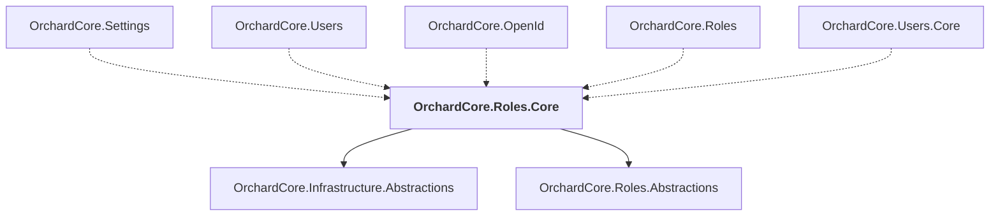

# OrchardCore.Roles.Core

## Overview

| Property | Value |
|----------|-------|
| Category | Library |
| Repository | src |
| Path | `OrchardCore/OrchardCore.Roles.Core/OrchardCore.Roles.Core.csproj` |
| Project References | 2 |
| NuGet Dependencies | 0 |
| Consumers | 5 |

## Dependency Diagram

## Project References
- OrchardCore.Infrastructure.Abstractions
- OrchardCore.Roles.Abstractions

## Consumed By
- OrchardCore.Settings
- OrchardCore.Users
- OrchardCore.OpenId
- OrchardCore.Roles
- OrchardCore.Users.Core

---

*[Back to Index](../../index.md)*
