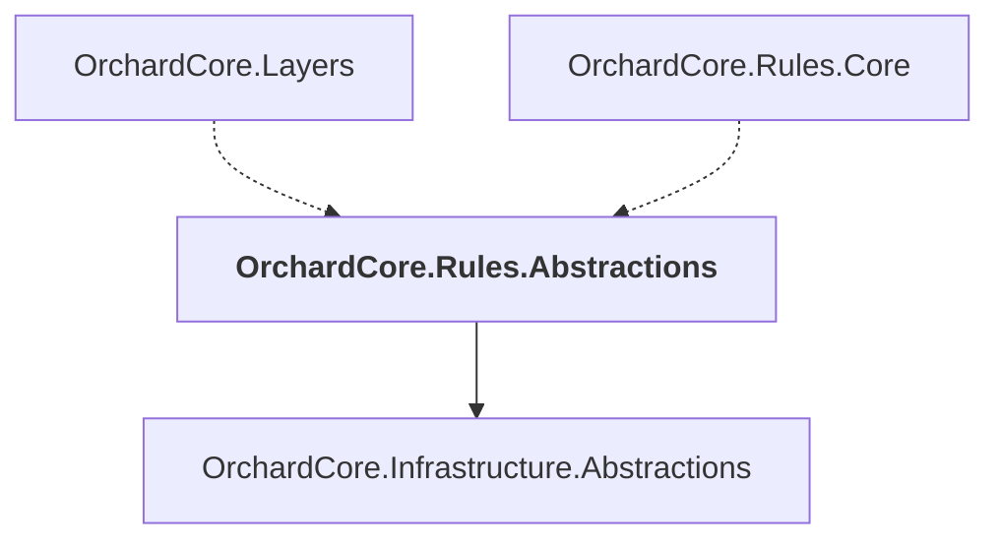

# OrchardCore.Rules.Abstractions

## Overview

| Property | Value |
|----------|-------|
| Category | Library |
| Repository | src |
| Path | `OrchardCore/OrchardCore.Rules.Abstractions/OrchardCore.Rules.Abstractions.csproj` |
| Project References | 1 |
| NuGet Dependencies | 0 |
| Consumers | 2 |

## Dependency Diagram

## Project References
- OrchardCore.Infrastructure.Abstractions

## Consumed By
- OrchardCore.Layers
- OrchardCore.Rules.Core

---

*[Back to Index](../../index.md)*
