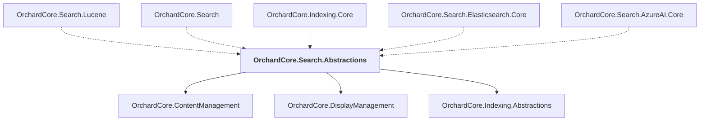

# OrchardCore.Search.Abstractions

## Overview

| Property | Value |
|----------|-------|
| Category | Library |
| Repository | src |
| Path | `OrchardCore/OrchardCore.Search.Abstractions/OrchardCore.Search.Abstractions.csproj` |
| Project References | 3 |
| NuGet Dependencies | 0 |
| Consumers | 5 |

## Dependency Diagram

## Project References
- OrchardCore.ContentManagement
- OrchardCore.DisplayManagement
- OrchardCore.Indexing.Abstractions

## Consumed By
- OrchardCore.Search.Lucene
- OrchardCore.Search
- OrchardCore.Indexing.Core
- OrchardCore.Search.Elasticsearch.Core
- OrchardCore.Search.AzureAI.Core

---

*[Back to Index](../../index.md)*
