# OrchardCore.Search.AzureAI.Core

## Overview

| Property | Value |
|----------|-------|
| Category | Library |
| Repository | src |
| Path | `OrchardCore/OrchardCore.Search.AzureAI.Core/OrchardCore.Search.AzureAI.Core.csproj` |
| Project References | 10 |
| NuGet Dependencies | 2 |
| Consumers | 1 |

## Dependency Diagram

```mermaid
graph TD
    OrchardCore_Search_AzureAI_Core["<strong>OrchardCore.Search.AzureAI.Core</strong>"]
    OrchardCore_Indexing["OrchardCore.Indexing"]
    OrchardCore_Search_AzureAI_Core --> OrchardCore_Indexing
    OrchardCore_Abstractions["OrchardCore.Abstractions"]
    OrchardCore_Search_AzureAI_Core --> OrchardCore_Abstractions
    OrchardCore_ContentLocalization_Abstractions["OrchardCore.ContentLocalization.Abstractions"]
    OrchardCore_Search_AzureAI_Core --> OrchardCore_ContentLocalization_Abstractions
    OrchardCore_ContentManagement_Abstractions["OrchardCore.ContentManagement.Abstractions"]
    OrchardCore_Search_AzureAI_Core --> OrchardCore_ContentManagement_Abstractions
    OrchardCore_ContentPreview_Abstractions["OrchardCore.ContentPreview.Abstractions"]
    OrchardCore_Search_AzureAI_Core --> OrchardCore_ContentPreview_Abstractions
    OrchardCore_Contents_Core["OrchardCore.Contents.Core"]
    OrchardCore_Search_AzureAI_Core --> OrchardCore_Contents_Core
    OrchardCore_Deployment_Abstractions["OrchardCore.Deployment.Abstractions"]
    OrchardCore_Search_AzureAI_Core --> OrchardCore_Deployment_Abstractions
    OrchardCore_Indexing_Core["OrchardCore.Indexing.Core"]
    OrchardCore_Search_AzureAI_Core --> OrchardCore_Indexing_Core
    OrchardCore_Infrastructure_Abstractions["OrchardCore.Infrastructure.Abstractions"]
    OrchardCore_Search_AzureAI_Core --> OrchardCore_Infrastructure_Abstractions
    OrchardCore_Search_Abstractions["OrchardCore.Search.Abstractions"]
    OrchardCore_Search_AzureAI_Core --> OrchardCore_Search_Abstractions
    OrchardCore_Search_AzureAI["OrchardCore.Search.AzureAI"]
    OrchardCore_Search_AzureAI -.-> OrchardCore_Search_AzureAI_Core
```

## Project References
- OrchardCore.Indexing
- OrchardCore.Abstractions
- OrchardCore.ContentLocalization.Abstractions
- OrchardCore.ContentManagement.Abstractions
- OrchardCore.ContentPreview.Abstractions
- OrchardCore.Contents.Core
- OrchardCore.Deployment.Abstractions
- OrchardCore.Indexing.Core
- OrchardCore.Infrastructure.Abstractions
- OrchardCore.Search.Abstractions

## Consumed By
- OrchardCore.Search.AzureAI

## External NuGet Packages
| Package | Version |
|---------|---------||
| Azure.Search.Documents |  |
| Microsoft.Extensions.Azure |  |

---

*[Back to Index](../../index.md)*
