# OrchardCore.Search.Elasticsearch.Core

## Overview

| Property | Value |
|----------|-------|
| Category | Library |
| Repository | src |
| Path | `OrchardCore/OrchardCore.Search.Elasticsearch.Core/OrchardCore.Search.Elasticsearch.Core.csproj` |
| Project References | 11 |
| NuGet Dependencies | 1 |
| Consumers | 1 |

## Dependency Diagram

```mermaid
graph TD
    OrchardCore_Search_Elasticsearch_Core["<strong>OrchardCore.Search.Elasticsearch.Core</strong>"]
    OrchardCore_ContentLocalization_Abstractions["OrchardCore.ContentLocalization.Abstractions"]
    OrchardCore_Search_Elasticsearch_Core --> OrchardCore_ContentLocalization_Abstractions
    OrchardCore_ContentManagement["OrchardCore.ContentManagement"]
    OrchardCore_Search_Elasticsearch_Core --> OrchardCore_ContentManagement
    OrchardCore_ContentPreview_Abstractions["OrchardCore.ContentPreview.Abstractions"]
    OrchardCore_Search_Elasticsearch_Core --> OrchardCore_ContentPreview_Abstractions
    OrchardCore_Contents_Core["OrchardCore.Contents.Core"]
    OrchardCore_Search_Elasticsearch_Core --> OrchardCore_Contents_Core
    OrchardCore_ContentTypes_Abstractions["OrchardCore.ContentTypes.Abstractions"]
    OrchardCore_Search_Elasticsearch_Core --> OrchardCore_ContentTypes_Abstractions
    OrchardCore_Deployment_Abstractions["OrchardCore.Deployment.Abstractions"]
    OrchardCore_Search_Elasticsearch_Core --> OrchardCore_Deployment_Abstractions
    OrchardCore_Indexing_Abstractions["OrchardCore.Indexing.Abstractions"]
    OrchardCore_Search_Elasticsearch_Core --> OrchardCore_Indexing_Abstractions
    OrchardCore_Indexing_Core["OrchardCore.Indexing.Core"]
    OrchardCore_Search_Elasticsearch_Core --> OrchardCore_Indexing_Core
    OrchardCore_Liquid_Abstractions["OrchardCore.Liquid.Abstractions"]
    OrchardCore_Search_Elasticsearch_Core --> OrchardCore_Liquid_Abstractions
    OrchardCore_Queries_Abstractions["OrchardCore.Queries.Abstractions"]
    OrchardCore_Search_Elasticsearch_Core --> OrchardCore_Queries_Abstractions
    OrchardCore_Search_Abstractions["OrchardCore.Search.Abstractions"]
    OrchardCore_Search_Elasticsearch_Core --> OrchardCore_Search_Abstractions
    OrchardCore_Search_Elasticsearch["OrchardCore.Search.Elasticsearch"]
    OrchardCore_Search_Elasticsearch -.-> OrchardCore_Search_Elasticsearch_Core
```

## Project References
- OrchardCore.ContentLocalization.Abstractions
- OrchardCore.ContentManagement
- OrchardCore.ContentPreview.Abstractions
- OrchardCore.Contents.Core
- OrchardCore.ContentTypes.Abstractions
- OrchardCore.Deployment.Abstractions
- OrchardCore.Indexing.Abstractions
- OrchardCore.Indexing.Core
- OrchardCore.Liquid.Abstractions
- OrchardCore.Queries.Abstractions
- OrchardCore.Search.Abstractions

## Consumed By
- OrchardCore.Search.Elasticsearch

## External NuGet Packages
| Package | Version |
|---------|---------||
| Elastic.Clients.Elasticsearch |  |

---

*[Back to Index](../../index.md)*
