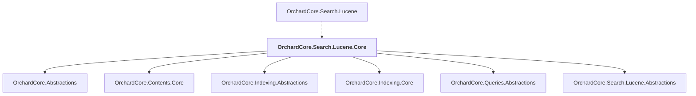

# OrchardCore.Search.Lucene.Core

## Overview

| Property | Value |
|----------|-------|
| Category | Library |
| Repository | src |
| Path | `OrchardCore/OrchardCore.Search.Lucene.Core/OrchardCore.Search.Lucene.Core.csproj` |
| Project References | 6 |
| NuGet Dependencies | 2 |
| Consumers | 1 |

## Dependency Diagram

## Project References
- OrchardCore.Abstractions
- OrchardCore.Contents.Core
- OrchardCore.Indexing.Abstractions
- OrchardCore.Indexing.Core
- OrchardCore.Queries.Abstractions
- OrchardCore.Search.Lucene.Abstractions

## Consumed By
- OrchardCore.Search.Lucene

## External NuGet Packages
| Package | Version |
|---------|---------||
| Lucene.Net.QueryParser |  |
| Lucene.Net.Spatial |  |

---

*[Back to Index](../../index.md)*
