# OrchardCore.Search.Lucene

## Overview

| Property | Value |
|----------|-------|
| Category | Library |
| Repository | src |
| Path | `OrchardCore.Modules/OrchardCore.Search.Lucene/OrchardCore.Search.Lucene.csproj` |
| Project References | 22 |
| NuGet Dependencies | 3 |
| Consumers | 1 |

## Dependency Diagram

```mermaid
graph TD
    OrchardCore_Search_Lucene["<strong>OrchardCore.Search.Lucene</strong>"]
    OrchardCore_Admin_Abstractions["OrchardCore.Admin.Abstractions"]
    OrchardCore_Search_Lucene --> OrchardCore_Admin_Abstractions
    OrchardCore_ContentLocalization_Abstractions["OrchardCore.ContentLocalization.Abstractions"]
    OrchardCore_Search_Lucene --> OrchardCore_ContentLocalization_Abstractions
    OrchardCore_ContentManagement_Display["OrchardCore.ContentManagement.Display"]
    OrchardCore_Search_Lucene --> OrchardCore_ContentManagement_Display
    OrchardCore_ContentManagement_GraphQL["OrchardCore.ContentManagement.GraphQL"]
    OrchardCore_Search_Lucene --> OrchardCore_ContentManagement_GraphQL
    OrchardCore_ContentManagement["OrchardCore.ContentManagement"]
    OrchardCore_Search_Lucene --> OrchardCore_ContentManagement
    OrchardCore_ContentPreview_Abstractions["OrchardCore.ContentPreview.Abstractions"]
    OrchardCore_Search_Lucene --> OrchardCore_ContentPreview_Abstractions
    OrchardCore_ContentTypes_Abstractions["OrchardCore.ContentTypes.Abstractions"]
    OrchardCore_Search_Lucene --> OrchardCore_ContentTypes_Abstractions
    OrchardCore_Contents_Core["OrchardCore.Contents.Core"]
    OrchardCore_Search_Lucene --> OrchardCore_Contents_Core
    OrchardCore_Data_Abstractions["OrchardCore.Data.Abstractions"]
    OrchardCore_Search_Lucene --> OrchardCore_Data_Abstractions
    OrchardCore_Deployment_Abstractions["OrchardCore.Deployment.Abstractions"]
    OrchardCore_Search_Lucene --> OrchardCore_Deployment_Abstractions
    OrchardCore_DisplayManagement["OrchardCore.DisplayManagement"]
    OrchardCore_Search_Lucene --> OrchardCore_DisplayManagement
    OrchardCore_Indexing_Abstractions["OrchardCore.Indexing.Abstractions"]
    OrchardCore_Search_Lucene --> OrchardCore_Indexing_Abstractions
    OrchardCore_Indexing_Core["OrchardCore.Indexing.Core"]
    OrchardCore_Search_Lucene --> OrchardCore_Indexing_Core
    OrchardCore_Localization_Abstractions["OrchardCore.Localization.Abstractions"]
    OrchardCore_Search_Lucene --> OrchardCore_Localization_Abstractions
    OrchardCore_Liquid_Abstractions["OrchardCore.Liquid.Abstractions"]
    OrchardCore_Search_Lucene --> OrchardCore_Liquid_Abstractions
    OrchardCore_Module_Targets["OrchardCore.Module.Targets"]
    OrchardCore_Search_Lucene --> OrchardCore_Module_Targets
    OrchardCore_Navigation_Core["OrchardCore.Navigation.Core"]
    OrchardCore_Search_Lucene --> OrchardCore_Navigation_Core
    OrchardCore_Queries_Core["OrchardCore.Queries.Core"]
    OrchardCore_Search_Lucene --> OrchardCore_Queries_Core
    OrchardCore_Recipes_Abstractions["OrchardCore.Recipes.Abstractions"]
    OrchardCore_Search_Lucene --> OrchardCore_Recipes_Abstractions
    OrchardCore_ResourceManagement["OrchardCore.ResourceManagement"]
    OrchardCore_Search_Lucene --> OrchardCore_ResourceManagement
    OrchardCore_Search_Abstractions["OrchardCore.Search.Abstractions"]
    OrchardCore_Search_Lucene --> OrchardCore_Search_Abstractions
    OrchardCore_Search_Lucene_Core["OrchardCore.Search.Lucene.Core"]
    OrchardCore_Search_Lucene --> OrchardCore_Search_Lucene_Core
    OrchardCore_Application_Cms_Core_Targets["OrchardCore.Application.Cms.Core.Targets"]
    OrchardCore_Application_Cms_Core_Targets -.-> OrchardCore_Search_Lucene
```

## Project References
- OrchardCore.Admin.Abstractions
- OrchardCore.ContentLocalization.Abstractions
- OrchardCore.ContentManagement.Display
- OrchardCore.ContentManagement.GraphQL
- OrchardCore.ContentManagement
- OrchardCore.ContentPreview.Abstractions
- OrchardCore.ContentTypes.Abstractions
- OrchardCore.Contents.Core
- OrchardCore.Data.Abstractions
- OrchardCore.Deployment.Abstractions
- OrchardCore.DisplayManagement
- OrchardCore.Indexing.Abstractions
- OrchardCore.Indexing.Core
- OrchardCore.Localization.Abstractions
- OrchardCore.Liquid.Abstractions
- OrchardCore.Module.Targets
- OrchardCore.Navigation.Core
- OrchardCore.Queries.Core
- OrchardCore.Recipes.Abstractions
- OrchardCore.ResourceManagement
- OrchardCore.Search.Abstractions
- OrchardCore.Search.Lucene.Core

## Consumed By
- OrchardCore.Application.Cms.Core.Targets

## External NuGet Packages
| Package | Version |
|---------|---------||
| Lucene.Net.Analysis.Common |  |
| Lucene.Net.QueryParser |  |
| Lucene.Net.Spatial |  |

---

*[Back to Index](../../index.md)*
