# OrchardCore.Search

## Overview

| Property | Value |
|----------|-------|
| Category | Library |
| Repository | src |
| Path | `OrchardCore.Modules/OrchardCore.Search/OrchardCore.Search.csproj` |
| Project References | 9 |
| NuGet Dependencies | 0 |
| Consumers | 1 |

## Dependency Diagram

```mermaid
graph TD
    OrchardCore_Search["<strong>OrchardCore.Search</strong>"]
    OrchardCore_ContentManagement["OrchardCore.ContentManagement"]
    OrchardCore_Search --> OrchardCore_ContentManagement
    OrchardCore_ContentTypes_Abstractions["OrchardCore.ContentTypes.Abstractions"]
    OrchardCore_Search --> OrchardCore_ContentTypes_Abstractions
    OrchardCore_DisplayManagement["OrchardCore.DisplayManagement"]
    OrchardCore_Search --> OrchardCore_DisplayManagement
    OrchardCore_Indexing_Abstractions["OrchardCore.Indexing.Abstractions"]
    OrchardCore_Search --> OrchardCore_Indexing_Abstractions
    OrchardCore_Indexing_Core["OrchardCore.Indexing.Core"]
    OrchardCore_Search --> OrchardCore_Indexing_Core
    OrchardCore_Module_Targets["OrchardCore.Module.Targets"]
    OrchardCore_Search --> OrchardCore_Module_Targets
    OrchardCore_Navigation_Core["OrchardCore.Navigation.Core"]
    OrchardCore_Search --> OrchardCore_Navigation_Core
    OrchardCore_Search_Abstractions["OrchardCore.Search.Abstractions"]
    OrchardCore_Search --> OrchardCore_Search_Abstractions
    OrchardCore_Deployment["OrchardCore.Deployment"]
    OrchardCore_Search --> OrchardCore_Deployment
    OrchardCore_Application_Cms_Core_Targets["OrchardCore.Application.Cms.Core.Targets"]
    OrchardCore_Application_Cms_Core_Targets -.-> OrchardCore_Search
```

## Project References
- OrchardCore.ContentManagement
- OrchardCore.ContentTypes.Abstractions
- OrchardCore.DisplayManagement
- OrchardCore.Indexing.Abstractions
- OrchardCore.Indexing.Core
- OrchardCore.Module.Targets
- OrchardCore.Navigation.Core
- OrchardCore.Search.Abstractions
- OrchardCore.Deployment

## Consumed By
- OrchardCore.Application.Cms.Core.Targets

---

*[Back to Index](../../index.md)*
