# OrchardCore.Settings.Core

## Overview

| Property | Value |
|----------|-------|
| Category | Library |
| Repository | src |
| Path | `OrchardCore/OrchardCore.Settings.Core/OrchardCore.Settings.Core.csproj` |
| Project References | 2 |
| NuGet Dependencies | 0 |
| Consumers | 12 |

## Dependency Diagram

```mermaid
graph TD
    OrchardCore_Settings_Core["<strong>OrchardCore.Settings.Core</strong>"]
    OrchardCore_Abstractions["OrchardCore.Abstractions"]
    OrchardCore_Settings_Core --> OrchardCore_Abstractions
    OrchardCore_Deployment_Abstractions["OrchardCore.Deployment.Abstractions"]
    OrchardCore_Settings_Core --> OrchardCore_Deployment_Abstractions
    OrchardCore_AuditTrail["OrchardCore.AuditTrail"]
    OrchardCore_AuditTrail -.-> OrchardCore_Settings_Core
    OrchardCore_Settings["OrchardCore.Settings"]
    OrchardCore_Settings -.-> OrchardCore_Settings_Core
    OrchardCore_Taxonomies["OrchardCore.Taxonomies"]
    OrchardCore_Taxonomies -.-> OrchardCore_Settings_Core
    OrchardCore_Google["OrchardCore.Google"]
    OrchardCore_Google -.-> OrchardCore_Settings_Core
    OrchardCore_Users["OrchardCore.Users"]
    OrchardCore_Users -.-> OrchardCore_Settings_Core
    OrchardCore_Admin["OrchardCore.Admin"]
    OrchardCore_Admin -.-> OrchardCore_Settings_Core
    OrchardCore_ReverseProxy["OrchardCore.ReverseProxy"]
    OrchardCore_ReverseProxy -.-> OrchardCore_Settings_Core
    OrchardCore_DataLocalization["OrchardCore.DataLocalization"]
    OrchardCore_DataLocalization -.-> OrchardCore_Settings_Core
    OrchardCore_Contents["OrchardCore.Contents"]
    OrchardCore_Contents -.-> OrchardCore_Settings_Core
    OrchardCore_Localization["OrchardCore.Localization"]
    OrchardCore_Localization -.-> OrchardCore_Settings_Core
    OrchardCore_Https["OrchardCore.Https"]
    OrchardCore_Https -.-> OrchardCore_Settings_Core
    OrchardCore_ReCaptcha["OrchardCore.ReCaptcha"]
    OrchardCore_ReCaptcha -.-> OrchardCore_Settings_Core
```

## Project References
- OrchardCore.Abstractions
- OrchardCore.Deployment.Abstractions

## Consumed By
- OrchardCore.AuditTrail
- OrchardCore.Settings
- OrchardCore.Taxonomies
- OrchardCore.Google
- OrchardCore.Users
- OrchardCore.Admin
- OrchardCore.ReverseProxy
- OrchardCore.DataLocalization
- OrchardCore.Contents
- OrchardCore.Localization
- OrchardCore.Https
- OrchardCore.ReCaptcha

---

*[Back to Index](../../index.md)*
