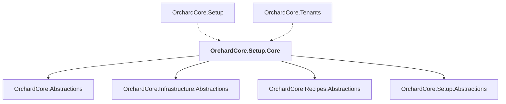

# OrchardCore.Setup.Core

## Overview

| Property | Value |
|----------|-------|
| Category | Library |
| Repository | src |
| Path | `OrchardCore/OrchardCore.Setup.Core/OrchardCore.Setup.Core.csproj` |
| Project References | 4 |
| NuGet Dependencies | 1 |
| Consumers | 2 |

## Dependency Diagram

## Project References
- OrchardCore.Abstractions
- OrchardCore.Infrastructure.Abstractions
- OrchardCore.Recipes.Abstractions
- OrchardCore.Setup.Abstractions

## Consumed By
- OrchardCore.Setup
- OrchardCore.Tenants

## External NuGet Packages
| Package | Version |
|---------|---------||
| YesSql |  |

---

*[Back to Index](../../index.md)*
