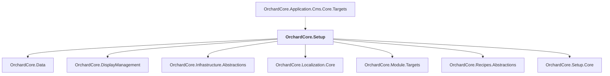

# OrchardCore.Setup

## Overview

| Property | Value |
|----------|-------|
| Category | Library |
| Repository | src |
| Path | `OrchardCore.Modules/OrchardCore.Setup/OrchardCore.Setup.csproj` |
| Project References | 7 |
| NuGet Dependencies | 0 |
| Consumers | 1 |

## Dependency Diagram

## Project References
- OrchardCore.Data
- OrchardCore.DisplayManagement
- OrchardCore.Infrastructure.Abstractions
- OrchardCore.Localization.Core
- OrchardCore.Module.Targets
- OrchardCore.Recipes.Abstractions
- OrchardCore.Setup.Core

## Consumed By
- OrchardCore.Application.Cms.Core.Targets

---

*[Back to Index](../../index.md)*
