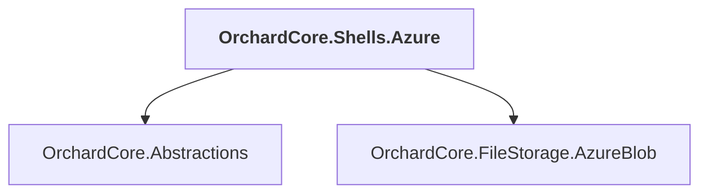

# OrchardCore.Shells.Azure

## Overview

| Property | Value |
|----------|-------|
| Category | Library |
| Repository | src |
| Path | `OrchardCore/OrchardCore.Shells.Azure/OrchardCore.Shells.Azure.csproj` |
| Project References | 2 |
| NuGet Dependencies | 0 |
| Consumers | 0 |

## Dependency Diagram

## Project References
- OrchardCore.Abstractions
- OrchardCore.FileStorage.AzureBlob

---

*[Back to Index](../../index.md)*
