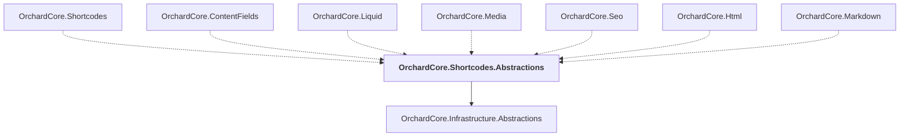

# OrchardCore.Shortcodes.Abstractions

## Overview

| Property | Value |
|----------|-------|
| Category | Library |
| Repository | src |
| Path | `OrchardCore/OrchardCore.Shortcodes.Abstractions/OrchardCore.Shortcodes.Abstractions.csproj` |
| Project References | 1 |
| NuGet Dependencies | 1 |
| Consumers | 7 |

## Dependency Diagram

## Project References
- OrchardCore.Infrastructure.Abstractions

## Consumed By
- OrchardCore.Shortcodes
- OrchardCore.ContentFields
- OrchardCore.Liquid
- OrchardCore.Media
- OrchardCore.Seo
- OrchardCore.Html
- OrchardCore.Markdown

## External NuGet Packages
| Package | Version |
|---------|---------||
| Shortcodes |  |

---

*[Back to Index](../../index.md)*
