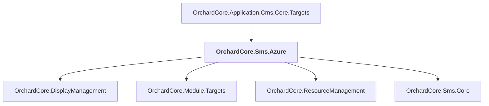

# OrchardCore.Sms.Azure

## Overview

| Property | Value |
|----------|-------|
| Category | Library |
| Repository | src |
| Path | `OrchardCore.Modules/OrchardCore.Sms.Azure/OrchardCore.Sms.Azure.csproj` |
| Project References | 4 |
| NuGet Dependencies | 1 |
| Consumers | 1 |

## Dependency Diagram

## Project References
- OrchardCore.DisplayManagement
- OrchardCore.Module.Targets
- OrchardCore.ResourceManagement
- OrchardCore.Sms.Core

## Consumed By
- OrchardCore.Application.Cms.Core.Targets

## External NuGet Packages
| Package | Version |
|---------|---------||
| Azure.Communication.Sms |  |

---

*[Back to Index](../../index.md)*
