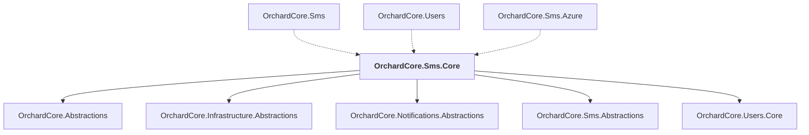

# OrchardCore.Sms.Core

## Overview

| Property | Value |
|----------|-------|
| Category | Library |
| Repository | src |
| Path | `OrchardCore/OrchardCore.Sms.Core/OrchardCore.Sms.Core.csproj` |
| Project References | 5 |
| NuGet Dependencies | 2 |
| Consumers | 3 |

## Dependency Diagram

## Project References
- OrchardCore.Abstractions
- OrchardCore.Infrastructure.Abstractions
- OrchardCore.Notifications.Abstractions
- OrchardCore.Sms.Abstractions
- OrchardCore.Users.Core

## Consumed By
- OrchardCore.Sms
- OrchardCore.Users
- OrchardCore.Sms.Azure

## External NuGet Packages
| Package | Version |
|---------|---------||
| libphonenumber-csharp |  |
| Microsoft.Extensions.Http.Resilience |  |

---

*[Back to Index](../../index.md)*
