# OrchardCore.Taxonomies

## Overview

| Property | Value |
|----------|-------|
| Category | Library |
| Repository | src |
| Path | `OrchardCore.Modules/OrchardCore.Taxonomies/OrchardCore.Taxonomies.csproj` |
| Project References | 16 |
| NuGet Dependencies | 0 |
| Consumers | 1 |

## Dependency Diagram

```mermaid
graph TD
    OrchardCore_Taxonomies["<strong>OrchardCore.Taxonomies</strong>"]
    OrchardCore_Admin_Abstractions["OrchardCore.Admin.Abstractions"]
    OrchardCore_Taxonomies --> OrchardCore_Admin_Abstractions
    OrchardCore_Apis_GraphQL_Abstractions["OrchardCore.Apis.GraphQL.Abstractions"]
    OrchardCore_Taxonomies --> OrchardCore_Apis_GraphQL_Abstractions
    OrchardCore_ContentManagement_Abstractions["OrchardCore.ContentManagement.Abstractions"]
    OrchardCore_Taxonomies --> OrchardCore_ContentManagement_Abstractions
    OrchardCore_ContentManagement_GraphQL["OrchardCore.ContentManagement.GraphQL"]
    OrchardCore_Taxonomies --> OrchardCore_ContentManagement_GraphQL
    OrchardCore_ContentManagement["OrchardCore.ContentManagement"]
    OrchardCore_Taxonomies --> OrchardCore_ContentManagement
    OrchardCore_Contents_Core["OrchardCore.Contents.Core"]
    OrchardCore_Taxonomies --> OrchardCore_Contents_Core
    OrchardCore_ContentTypes_Abstractions["OrchardCore.ContentTypes.Abstractions"]
    OrchardCore_Taxonomies --> OrchardCore_ContentTypes_Abstractions
    OrchardCore_Data_Abstractions["OrchardCore.Data.Abstractions"]
    OrchardCore_Taxonomies --> OrchardCore_Data_Abstractions
    OrchardCore_DisplayManagement["OrchardCore.DisplayManagement"]
    OrchardCore_Taxonomies --> OrchardCore_DisplayManagement
    OrchardCore_Indexing_Abstractions["OrchardCore.Indexing.Abstractions"]
    OrchardCore_Taxonomies --> OrchardCore_Indexing_Abstractions
    OrchardCore_Liquid_Abstractions["OrchardCore.Liquid.Abstractions"]
    OrchardCore_Taxonomies --> OrchardCore_Liquid_Abstractions
    OrchardCore_Module_Targets["OrchardCore.Module.Targets"]
    OrchardCore_Taxonomies --> OrchardCore_Module_Targets
    OrchardCore_Navigation_Core["OrchardCore.Navigation.Core"]
    OrchardCore_Taxonomies --> OrchardCore_Navigation_Core
    OrchardCore_ResourceManagement["OrchardCore.ResourceManagement"]
    OrchardCore_Taxonomies --> OrchardCore_ResourceManagement
    OrchardCore_Settings_Core["OrchardCore.Settings.Core"]
    OrchardCore_Taxonomies --> OrchardCore_Settings_Core
    OrchardCore_Taxonomies_Core["OrchardCore.Taxonomies.Core"]
    OrchardCore_Taxonomies --> OrchardCore_Taxonomies_Core
    OrchardCore_Application_Cms_Core_Targets["OrchardCore.Application.Cms.Core.Targets"]
    OrchardCore_Application_Cms_Core_Targets -.-> OrchardCore_Taxonomies
```

## Project References
- OrchardCore.Admin.Abstractions
- OrchardCore.Apis.GraphQL.Abstractions
- OrchardCore.ContentManagement.Abstractions
- OrchardCore.ContentManagement.GraphQL
- OrchardCore.ContentManagement
- OrchardCore.Contents.Core
- OrchardCore.ContentTypes.Abstractions
- OrchardCore.Data.Abstractions
- OrchardCore.DisplayManagement
- OrchardCore.Indexing.Abstractions
- OrchardCore.Liquid.Abstractions
- OrchardCore.Module.Targets
- OrchardCore.Navigation.Core
- OrchardCore.ResourceManagement
- OrchardCore.Settings.Core
- OrchardCore.Taxonomies.Core

## Consumed By
- OrchardCore.Application.Cms.Core.Targets

---

*[Back to Index](../../index.md)*
