# OrchardCore.Theme.Targets

## Overview

| Property | Value |
|----------|-------|
| Category | Library |
| Repository | src |
| Path | `OrchardCore/OrchardCore.Theme.Targets/OrchardCore.Theme.Targets.csproj` |
| Project References | 1 |
| NuGet Dependencies | 0 |
| Consumers | 17 |

## Dependency Diagram

```mermaid
graph TD
    OrchardCore_Theme_Targets["<strong>OrchardCore.Theme.Targets</strong>"]
    OrchardCore_Module_Targets["OrchardCore.Module.Targets"]
    OrchardCore_Theme_Targets --> OrchardCore_Module_Targets
    TheComingSoonTheme["TheComingSoonTheme"]
    TheComingSoonTheme -.-> OrchardCore_Theme_Targets
    TheTheme["TheTheme"]
    TheTheme -.-> OrchardCore_Theme_Targets
    TheBlogTheme["TheBlogTheme"]
    TheBlogTheme -.-> OrchardCore_Theme_Targets
    TheAdmin["TheAdmin"]
    TheAdmin -.-> OrchardCore_Theme_Targets
    TheAgencyTheme["TheAgencyTheme"]
    TheAgencyTheme -.-> OrchardCore_Theme_Targets
    SafeMode["SafeMode"]
    SafeMode -.-> OrchardCore_Theme_Targets
    DerivedThemeSample["DerivedThemeSample"]
    DerivedThemeSample -.-> OrchardCore_Theme_Targets
    BaseThemeSample2["BaseThemeSample2"]
    BaseThemeSample2 -.-> OrchardCore_Theme_Targets
    DerivedThemeSample2["DerivedThemeSample2"]
    DerivedThemeSample2 -.-> OrchardCore_Theme_Targets
    BaseThemeSample["BaseThemeSample"]
    BaseThemeSample -.-> OrchardCore_Theme_Targets
    Theme_Pages["Theme.Pages"]
    Theme_Pages -.-> OrchardCore_Theme_Targets
    Examples_Themes_AssyAttrib_Charlie["Examples.Themes.AssyAttrib.Charlie"]
    Examples_Themes_AssyAttrib_Charlie -.-> OrchardCore_Theme_Targets
    Examples_Themes_AssyAttrib_Bravo["Examples.Themes.AssyAttrib.Bravo"]
    Examples_Themes_AssyAttrib_Bravo -.-> OrchardCore_Theme_Targets
    Errors_OrchardCoreThemes_ThemeAndModule["Errors.OrchardCoreThemes.ThemeAndModule"]
    Errors_OrchardCoreThemes_ThemeAndModule -.-> OrchardCore_Theme_Targets
    Examples_Themes_AssyAttrib_Alpha["Examples.Themes.AssyAttrib.Alpha"]
    Examples_Themes_AssyAttrib_Alpha -.-> OrchardCore_Theme_Targets
    more_consumers["... +2 more"]
    more_consumers -.-> OrchardCore_Theme_Targets
```

## Project References
- OrchardCore.Module.Targets

## Consumed By
- TheComingSoonTheme
- TheTheme
- TheBlogTheme
- TheAdmin
- TheAgencyTheme
- SafeMode
- DerivedThemeSample
- BaseThemeSample2
- DerivedThemeSample2
- BaseThemeSample
- Theme.Pages
- Examples.Themes.AssyAttrib.Charlie
- Examples.Themes.AssyAttrib.Bravo
- Errors.OrchardCoreThemes.ThemeAndModule
- Examples.Themes.AssyAttrib.Alpha
- Examples.OrchardCoreThemes.Alpha
- Errors.OrchardCoreThemes.TwoPlus

---

*[Back to Index](../../index.md)*
